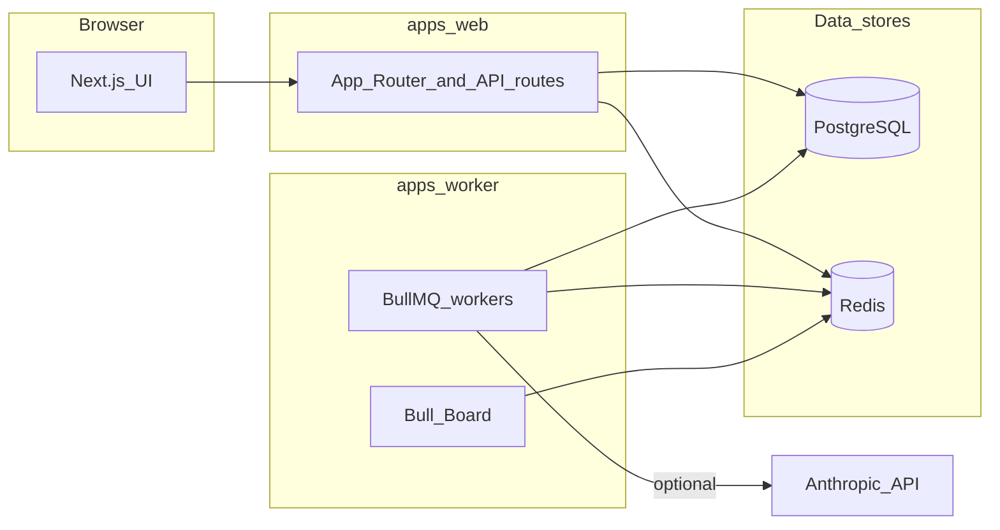

# Next.js refactor — review guide for Nick

This document is a **branch breakdown** for code review and manual QA. It complements the everyday onboarding docs ([README.md](README.md), [CLAUDE.md](CLAUDE.md), [LOCAL_SETUP.md](LOCAL_SETUP.md)).

---

## Before you review: branch and working tree

> **Note for Nick:** The migration is on branch **`nextjs-refactor`**. The **authoritative map** of what is supposed to exist in the new stack (routes, jobs, enum integers) is [docs/next-migration/PARITY_MATRIX.md](docs/next-migration/PARITY_MATRIX.md)—keep it open while you review.

1. **Check out the same branch** the author used (`nextjs-refactor`) and **pull the latest** (or use the PR branch they give you).

2. **Large refactors are sometimes split between “last pushed commit” and “local working tree.”** If what you see after `git pull` does not match what Will described (no `apps/web`, still seeing Rails), ask for an updated push—or compare with a shared patch.

   Useful commands:

   ```bash
   git status -sb
   git log --oneline main..HEAD
   ```

   If you need to capture “everything including uncommitted work” for yourself (not for secrets): `git diff` / `git stash` / asking the author to **commit and push** is safer than guessing.

3. **Never commit secrets.** Do not add `.env`, `apps/web/.env.local`, or stray editor logs (for example under `.cursor/`) to git. If those show up as tracked in a PR, stop and fix before merge.

---

## Executive summary

The legacy **Ruby on Rails + Sidekiq** application is **removed from this repository** in favor of a **TypeScript monorepo** managed with **Yarn workspaces**:

| Layer | Technology | Location |
|-------|------------|----------|
| Web UI + HTTP APIs | **Next.js 15** (App Router), React 19 | [`apps/web`](apps/web) |
| Background jobs | **BullMQ** + **Redis** | [`apps/worker`](apps/worker) |
| Database access | **Drizzle ORM** + `postgres` driver | [`packages/db`](packages/db) |
| Auth | **Auth.js** (JWT sessions; bcrypt-compatible with existing `users.encrypted_password`) | [`apps/web/src/app/api/auth`](apps/web/src/app/api/auth) |
| Integration secrets | **Lockbox-compatible** encryption | [`packages/db/src/lockbox.ts`](packages/db/src/lockbox.ts), `LOCKBOX_MASTER_KEY` |

> **Note for Nick:** The **database schema and enum integer values** must stay aligned with production data. Drizzle models in `packages/db` mirror the legacy Rails enums; [PARITY_MATRIX.md](docs/next-migration/PARITY_MATRIX.md) lists the integer mappings explicitly.

---

## How the pieces fit together



> **Note for Nick:** **Next.js** talks to Postgres for reads/writes and can **enqueue** BullMQ jobs via Redis. **Heavy work** (syncs, mail, AI batches) is intended to run in **`apps/worker`**, not inside a long-running API request. Bull Board is a **separate HTTP port** on the worker (default **3002**), not on the Next app.

---

## Repository map (where to look)

| Path | What lives there |
|------|------------------|
| [`apps/web/src/app`](apps/web/src/app) | App Router: public pages, `/login`, authenticated `/app/*` |
| [`apps/web/src/app/app/layout.tsx`](apps/web/src/app/app/layout.tsx) | Authenticated shell, **onboarding gating**, sidebar |
| [`apps/web/src/app/app/set-project/route.ts`](apps/web/src/app/app/set-project/route.ts) | Sets httpOnly **current project** cookie when switching projects |
| [`apps/web/src/app/api`](apps/web/src/app/api) | Route handlers: Auth.js, health, a few `/api/app/*` JSON endpoints, webhooks, public API |
| [`apps/web/src/app/app`](apps/web/src/app/app) | Authenticated pages plus **`actions.ts` Server Actions** (projects, feedback, integrations, etc.)—not everything goes through `route.ts` |
| [`apps/web/src/app/api/v1/feedback/route.ts`](apps/web/src/app/api/v1/feedback/route.ts) | Public `POST /api/v1/feedback` (API key) |
| [`apps/web/src/app/api/webhooks`](apps/web/src/app/api/webhooks) | Linear, Slack, Jira inbound webhooks |
| [`apps/worker/src`](apps/worker/src) | Worker entry, Redis, schedules, job handlers, Bull Board |
| [`apps/worker/src/job-handlers.ts`](apps/worker/src/job-handlers.ts) | BullMQ processors (`process_feedback`, daily pulse, sync stubs, etc.) |
| [`apps/worker/src/schedules.ts`](apps/worker/src/schedules.ts) | Repeatable jobs / cron-style registration |
| [`packages/db/src/schema.ts`](packages/db/src/schema.ts) | Drizzle tables and relations |
| [`packages/db/src/enums.ts`](packages/db/src/enums.ts) | Shared enums (keep in sync with DB integers) |
| [`scripts/bootstrap-dev-user.mjs`](scripts/bootstrap-dev-user.mjs) | Dev users (`admin@example.com` / `password123`, etc.) |
| [`scripts/document-skills-and-agents.mjs`](scripts/document-skills-and-agents.mjs) | Regenerates / checks [`docs/skills-and-agents.md`](docs/skills-and-agents.md) |
| [`.github/workflows/ci.yml`](.github/workflows/ci.yml) | CI: Node 20, `yarn install --frozen-lockfile`, web lint, Vitest (db/web/worker), worker build, Next production build, skills inventory `--check` |
| [`.claude/skills`](.claude/skills) | Claude Code skills (repo-specific workflows); inventory enforced in CI |

Archived migration notes (Auth.js, Lockbox verification, old Sidekiq schedule YAML) live under [`docs/archive/next-migration/`](docs/archive/next-migration/).

---

## What changed vs `main` (conceptual)

These themes matter more than memorizing every deleted path:

- **Removed:** Rails app surface area—`Gemfile`, `config/routes.rb`, `app/controllers`, `app/jobs`, `app/models`, `app/views`, RSpec, Kamal/Ruby tooling tied to the old stack, and so on.
- **Added:** `apps/web`, `apps/worker`, `packages/db`, root **`package.json`** workspaces, TypeScript tests (**Vitest**), updated **Docker** / **Procfile** / **Render** wiring for Node.
- **CI:** GitHub Actions now runs the **Node** pipeline (see [`.github/workflows/ci.yml`](.github/workflows/ci.yml)); Ruby jobs are gone.
- **Docs:** [README.md](README.md), [CLAUDE.md](CLAUDE.md), and [docs/skills-and-agents.md](docs/skills-and-agents.md) target the new stack. [PARITY_MATRIX.md](docs/next-migration/PARITY_MATRIX.md) is the Rails → Next route/job checklist.

> **Note for Nick:** For the exact file list, use the **PR diff** on GitHub or `git diff main...HEAD` once everything is committed—do not rely on memory.

---

## Running it locally (minimal path)

1. **Install:** `yarn install` (from repo root).

2. **Environment:** Copy [`.env.example`](.env.example) to `.env` and fill at least:

   - `DATABASE_URL` — PostgreSQL
   - `REDIS_URL` — Redis (BullMQ)
   - `AUTH_SECRET` — long random string (Auth.js)
   - `NEXTAUTH_URL` — e.g. `http://localhost:3001`
   - `LOCKBOX_MASTER_KEY` — 64 hex chars (see `.env.example` comment)

   Optional but useful for realistic testing: `ANTHROPIC_API_KEY`, Google OAuth vars, webhook-related secrets (see [PARITY_MATRIX environment table](docs/next-migration/PARITY_MATRIX.md)).

3. **Database:** Ensure Postgres matches what Drizzle expects for this branch. If you are starting fresh, follow [db/README.md](db/README.md) and the `packages/db` scripts your team uses (`drizzle-kit` push/migrate—confirm with Will for the canonical command in your environment).

4. **Dev users:** `node scripts/bootstrap-dev-user.mjs` (reads `.env` or `apps/web/.env.local`).

5. **Dev servers:** `yarn dev` runs **Next on port 3001** and the **worker** (Bull Board default **http://localhost:3002/admin/queues**—see [`apps/worker/.env.example`](apps/worker/.env.example)).

> **Note for Nick:** Will keeps a dev server running locally; if you already have `yarn dev`, **refresh or restart** after pulling large changes. Docker: `docker compose up` — see [docker-compose.yml](docker-compose.yml) and [LOCAL_SETUP.md](LOCAL_SETUP.md).

---

## Suggested PR reading order

1. Root [`package.json`](package.json) — workspaces and scripts (`yarn dev`, `yarn test`, `yarn ci:local`).
2. [`packages/db/src/schema.ts`](packages/db/src/schema.ts) + [`packages/db/src/enums.ts`](packages/db/src/enums.ts) — data model and legacy integer enums.
3. [`apps/web`](apps/web) — Auth.js configuration, [`apps/web/src/middleware.ts`](apps/web/src/middleware.ts) (if present), [`apps/web/src/app/app/layout.tsx`](apps/web/src/app/app/layout.tsx) (project cookie + onboarding).
4. [`apps/web/src/app/api`](apps/web/src/app/api) — `auth`, `v1/feedback`, `webhooks`, `health`, and the small [`apps/web/src/app/api/app`](apps/web/src/app/api/app) surface.
5. [`apps/web/src/app/app`](apps/web/src/app/app) — `**/actions.ts` Server Actions (mutations and enqueue paths live here alongside pages).
6. [`apps/worker/src`](apps/worker/src) — `index.ts`, `schedules.ts`, [`job-handlers.ts`](apps/worker/src/job-handlers.ts), Bull Board.
7. [`.github/workflows/ci.yml`](.github/workflows/ci.yml) — what must pass before merge.

---

## Manual test checklist

Use this as a **structured pass**; tick boxes in your own notes or PR comment.

### Auth and session

- [ ] Log in with bootstrapped credentials ([README.md](README.md) lists defaults).
- [ ] If Google OAuth env vars are set: Google sign-in and account linking behave as expected.
- [ ] Session survives refresh; logout works.

### Current project and onboarding

- [ ] **Project switcher** updates context; verify httpOnly **current project** behavior via [`apps/web/src/app/app/set-project/route.ts`](apps/web/src/app/app/set-project/route.ts) / UI.
- [ ] **Onboarding gating** in [`apps/web/src/app/app/layout.tsx`](apps/web/src/app/app/layout.tsx): new/incomplete users are guided; completed onboarding reaches the dashboard.
- [ ] Onboarding **step UI** (progress bubbles / labels) renders sensibly on desktop and narrow widths.

### Core app surfaces (`/app/*`)

- [ ] **Dashboard** (`/app`) loads for the selected project.
- [ ] **Projects:** list, create, edit, delete; **members** page; switching projects.
- [ ] **Feedback:** list with filters/pagination, detail view, bulk actions, **reprocess** / AI-related actions as implemented.
- [ ] **Integrations:** CRUD, **sync enqueue** (and that worker picks up jobs—check Bull Board).
- [ ] **Recipients** (email recipients): CRUD.
- [ ] **Settings:** GitHub / Lockbox paths save and reload without leaking secrets in the UI.
- [ ] **Pulse reports:** list/detail; **queue daily pulse** / **resend**; **GitHub PR** actions match expected stub behavior (see parity notes below).
- [ ] **Skills:** CRUD in UI aligns with files under `.claude/skills/<name>/SKILL.md` if that flow is wired.

### Public API

- [ ] `POST /api/v1/feedback` with a valid **API key** creates feedback in the correct **project** (see [apps/web/src/app/api/v1/feedback/route.ts](apps/web/src/app/api/v1/feedback/route.ts)).
- [ ] Invalid key / validation errors return sensible HTTP status and JSON.

### Webhooks

- [ ] **Linear** — signature / secret behavior ([apps/web/src/app/api/webhooks/linear/route.ts](apps/web/src/app/api/webhooks/linear/route.ts)).
- [ ] **Slack** — Slack signing secret ([apps/web/src/app/api/webhooks/slack/route.ts](apps/web/src/app/api/webhooks/slack/route.ts)).
- [ ] **Jira** — HMAC / integration secret ([apps/web/src/app/api/webhooks/jira/route.ts](apps/web/src/app/api/webhooks/jira/route.ts)).

> **Note for Nick:** Use **test payloads** or staging integrations; do not paste real customer content into tickets.

### Worker and BullMQ

- [ ] With **Redis** up, `yarn dev` shows worker logging; open **Bull Board** (port **3002** by default).
- [ ] Enqueue **sync** or **mail** jobs from the UI where available; confirm they appear and complete or fail predictably.
- [ ] **`process_feedback`:** with **`ANTHROPIC_API_KEY` unset**, feedback still gets a stub summary; with key set, Anthropic HTTP path runs (see [`apps/worker/src/job-handlers.ts`](apps/worker/src/job-handlers.ts)).

### Health and CI parity

- [ ] `GET /api/health` returns OK ([apps/web/src/app/api/health/route.ts](apps/web/src/app/api/health/route.ts)).
- [ ] Before pushing: run the same gate as CI — from [CLAUDE.md](CLAUDE.md):

  ```bash
  yarn ci:local
  ```

  (Lint, tests, worker `tsc` via `yarn test`, Next production build with CI auth env vars, skills doc check.)

---

## Known gaps and stubs (from parity matrix)

The following is taken from the **“Latest parity work”** / **“Remaining”** themes in [docs/next-migration/PARITY_MATRIX.md](docs/next-migration/PARITY_MATRIX.md) (paraphrased for readability—confirm details in that file):

**Implemented areas (high level):** Authenticated shell with **current project** cookie (`/app/set-project`) and **onboarding gating** in `apps/web/src/app/app/layout.tsx`. Dashboard, projects (CRUD, members, switch), feedback (filters, pagination, detail, bulk, reprocess), onboarding steps, integrations (CRUD, sync enqueue), settings (GitHub via Lockbox), recipients, pulse reports (list/show, queue daily pulse / resend / **PR stub**), skills (CRUD + `.claude/skills/<name>/SKILL.md`) under `apps/web/src/app/app/`. Worker: real **`process_feedback`** (optional Anthropic HTTP), **`SendDailyPulseJob`** creates `pulse_reports` rows, **`GenerateGithubPrJob`** attempts marked failed until GitHub port is complete, scheduled sync jobs bump **`integrations.last_synced_at`**.

**Still called out as remaining:** full **transactional mailer** content / **SMTP** parity with Rails, Rails-style cached **“general settings”**, per-integration **`test_connection`** endpoints, and **full** sync / AI batch job logic (many jobs may still be thin or stubbed compared to legacy Sidekiq workers).

---

## After merge

This file is **review-only**. Once `nextjs-refactor` is merged and the team no longer needs a tour, you can delete or move **`NEXTJS_REFACTOR_REVIEW_FOR_NICK.md`** to `docs/archive/` to keep the repo root tidy.

---

*Generated for handoff on branch `nextjs-refactor`. Update [PARITY_MATRIX.md](docs/next-migration/PARITY_MATRIX.md) when behavior changes so this doc stays easy to validate against reality.*
