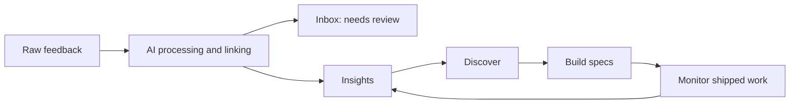

# Information Architecture Update - Inbox, Insights, and Evidence

> Written: Friday 8 May 2026  
> Branch: `information-architecture-update`  
> Recommended direction: **Option B - Inbox only for what needs attention**

---

## Why this change exists

The app currently gives raw feedback a top-level working surface inside Learn. That made sense while the product was proving ingestion, classification, and search. It now underplays the bigger product promise: xenoform.ai should turn raw customer noise into decisions a product team can trust.

The existing product principle is the "golden thread":

```text
feedback -> insight -> discovery activities -> spec -> feature -> monitored metric
```

This IA update makes that thread more visible. Feedback should still exist and stay auditable, but it should mostly be background evidence attached to higher-level objects:

- **Insights** answer "what is true or emerging?"
- **Discovery** answers "what do we still need to validate?"
- **Specs** answer "what are we going to build?"
- **Monitor** answers "did the shipped work solve the problem?"
- **Inbox** answers "what could automation not confidently handle?"

The goal is not to hide customer feedback. The goal is to stop asking PMs to manually browse every item when the system can classify, link, cluster, and summarize most of it for them.

---

## Product decision

Implement **Option B: Inbox only for what needs attention**.

Raw feedback becomes an evidence and audit layer. The main day-to-day Learn destination becomes **Insights**. A new or reframed **Inbox** surface shows only rows that require human judgment because automation is missing, uncertain, stale, or unable to link the item to an insight.

Longer term, this can evolve toward a full pipeline IA:



For this branch, do not attempt the full pipeline rebuild. Ship the IA direction first, then make the automation smarter in follow-up phases.

---

## Options considered

### Option A - Demote Feedback, Keep It Available

Move Feedback lower in the nav and describe it as an archive or audit trail. This is safe and useful, but it mostly changes labels. It does not make the app feel much smarter.

Use this only as the fallback if Inbox scope needs to be reduced.

### Option B - Inbox Only For What Needs Attention

Replace the idea of "go read feedback" with "the system processed feedback; review only the exceptions." This best matches the product direction and can be shipped incrementally using existing fields like `ai_processed_at`, `ai_confidence_score`, `manually_reviewed`, and `insight_processed_at`.

This is the recommended direction.

### Option C - Full Pipeline IA

Expose a full Capture -> Cluster -> Insights -> Discover -> Build -> Monitor pipeline. This is the strongest long-term mental model, but it needs more product surface area and stronger clustering/candidate-insight UX before it will feel real.

Use this as the north star, not the first implementation.

---

## Target navigation

Current Learn nav treats Feedback and Insights as sibling destinations. The updated IA should make **Insights** the primary Learn destination and move raw feedback into a lower-priority review/audit role.

### Phase 1 target sidebar

In `apps/web/src/app/app/layout.tsx`, update the Learn group toward this order:

```text
Learn
- Dashboard
- Insights
- Inbox
- Reporting
- Strategy
- Pulse reports
```

Recommended naming:

- Prefer **Inbox** for the primary exception queue.
- Use **All feedback** or **Evidence archive** for the complete raw-feedback search surface.
- Avoid using **Feedback** as the primary sidebar label, because it implies browsing raw rows is the normal workflow.

### Route guidance

For the first implementation, keep existing deep links working:

- Keep `/app/learn/feedback` available.
- If a new `/app/learn/inbox` route is added, it can reuse the existing feedback list UI with default filters.
- Do not break existing links generated by `feedbackListHref`.
- Add redirects only after the team decides which route is canonical.

Suggested route shape:

```text
/app/learn/insights          primary Learn destination
/app/learn/inbox             needs-review queue, filtered by default
/app/learn/feedback          all feedback / evidence archive, still searchable
```

If the team wants the smallest possible first pass, keep the route as `/app/learn/feedback` but relabel the sidebar item to **Inbox** and default the page to needs-review filters. Add the separate archive route later.

---

## Inbox model

Inbox should not mean "all feedback." Inbox should mean "items needing human attention."

A row should appear in Inbox when one or more of these conditions is true:

- `ai_processed_at IS NULL`: the item has not been processed by AI.
- `ai_confidence_score` is below the chosen threshold.
- `manually_reviewed = false`: the item has not been explicitly reviewed after automation.
- `insight_processed_at IS NULL` while `ai_processed_at IS NOT NULL`: the item was classified but has not yet been swept into insight discovery.
- No row exists in `feedback_insights` for the item.
- A `feedback_insights.relevance_score` value exists but is below the chosen confidence threshold.

Start conservative. The first Inbox query should use signals that clearly mean automation has not finished or could not make a confident decision:

```text
ai_processed_at IS NULL
OR insight_processed_at IS NULL
```

Use `manually_reviewed = false` carefully. If older imported data was never marked reviewed, that field may put too many historical rows into Inbox. Prefer adding it after a quick data audit, or combine it with a stronger exception signal such as low AI confidence or missing insight links.

Then add link-confidence and orphan-cluster logic after the developer has audited the actual data shape and query cost.

### Healthy state

The healthy state for Inbox should be empty or near empty.

Empty state copy should reinforce the new mental model:

> Inbox is clear. New feedback is being processed in the background and attached to insights when the system is confident.

### Actions from Inbox

Inbox rows should support a small set of clear actions:

- **Open evidence**: inspect the raw item.
- **Mark reviewed**: sets `manually_reviewed = true`.
- **Re-run AI**: uses the existing reprocess flow.
- **Link to insight**: future phase if manual linking does not already exist.
- **Promote to insight candidate**: future phase for clusters or orphan feedback.

Keep bulk actions only if they make sense for review work. The current feedback bulk toolbar may need copy changes so it does not feel like raw triage is the main product workflow.

---

## Insight-centered UX

Insights should become the place where users understand customer evidence.

The insight list should help PMs decide what to do next, not just browse generated rows. Useful signals:

- Number of supporting feedback items.
- New evidence since last review.
- Confidence score or confidence label.
- Discovery stage, if the insight is in Discover.
- Linked spec count or "No linked spec yet."
- "Ready for discovery" or "Ready to spec" hints.

The insight detail page should make raw feedback visible as evidence without forcing users into the raw feedback list. It should include:

- Representative quotes or summaries from linked feedback.
- Source, date, and customer context where available.
- A clear link to view the full evidence item.
- Existing actions to **Start Discovery** and **Create spec**.
- A small explanation that AI drafted or linked the evidence, where relevant.

This keeps trust high. PMs still see the words customers used, but they see them in the context of a decision.

---

## Dashboard and pulse framing

The dashboard currently emphasizes raw feedback counts. After this IA shift, dashboard emphasis should move toward insight and workflow states.

Prefer dashboard tiles such as:

- Insights ready for review.
- Inbox items needing attention.
- Insights ready for discovery.
- Discovery items stuck or waiting.
- Insights ready to spec.
- Shipped specs with new matching feedback.

Raw volume still matters, but it should become supporting context:

- Total feedback ingested.
- Feedback received today.
- AI processing backlog.

Pulse reports should follow the same hierarchy. Lead with what changed in insights, discovery, specs, and monitoring. Include raw feedback examples only as supporting evidence.

---

## Existing system signals to reuse

The current app already has useful primitives for this IA.

### Feedback processing

Feedback enters through integrations, the public API, webhooks, and admin tools. Many paths enqueue the `process_feedback` job. Batch processing also handles rows where `ai_processed_at` is still null.

Implementation note: audit each ingestion path before relying on Inbox counts. Some paths may insert feedback without immediately enqueueing `process_feedback`; those rows should still be picked up by batch processing, but they are useful test cases for the Inbox view.

Key existing fields:

- `feedbacks.ai_processed_at`
- `feedbacks.ai_confidence_score`
- `feedbacks.ai_summary`
- `feedbacks.manually_reviewed`
- `feedbacks.insight_processed_at`

### Feedback to insight linking

Insights are linked to feedback through `feedback_insights`, with fields such as:

- `feedback_id`
- `insight_id`
- `relevance_score`
- `contribution_summary`

This join table is central to making feedback a background evidence layer.

### Discovery and Build linkage

Discovery work is already linked to insights. Specs are already linked to insights through the Build flow. This branch should strengthen those links visually and in copy, not replace them.

---

## Implementation phases

### Phase 0 - Audit current copy and links

Goal: identify every place the app tells users to go to raw feedback first.

Tasks:

- Search for user-facing labels and copy containing "Feedback".
- List links to `/app/learn/feedback`.
- Check dashboard, insights, discovery, build empty states, and pulse report copy.
- Confirm which links must remain deep-link compatible.

Deliverable: a short note in the PR description summarizing changed labels and preserved routes.

### Phase 1 - Sidebar and copy pass

Goal: make Insights the primary Learn destination and reframe Feedback as Inbox.

Likely changes:

- In `apps/web/src/app/app/layout.tsx`, reorder Learn nav so `Insights` appears before the feedback-related route.
- Rename the sidebar label from **Feedback** to **Inbox** if reusing `/app/learn/feedback`.
- Update `PageHeader` copy on the feedback page to explain that this is a review queue or evidence archive.
- Update empty states so they point users toward Insights as the main Learn workflow.

This phase should not require database changes.

### Phase 2 - Inbox default filter

Goal: make Inbox show only rows needing attention.

Likely changes:

- Extend `apps/web/src/lib/feedback-list-query.ts` with a review-state query parameter, such as `view=needs_review` or `review=needs_attention`.
- Update `apps/web/src/app/app/learn/feedback/page.tsx` to apply the needs-review conditions when the Inbox view is active.
- Keep an explicit link to **All feedback** that removes the review filter.
- Add active filter chips that explain why the list is filtered.

Suggested first-pass behavior:

```text
Inbox default: needs-review rows
All feedback: complete searchable archive
```

If a dedicated `/app/learn/inbox` route is created, it can call the same underlying list component/query code with the needs-review default.

### Phase 3 - Insight evidence improvements

Goal: make insight pages feel like the right place to consume customer evidence.

Likely changes:

- Update `apps/web/src/app/app/learn/insights/page.tsx` to show stronger evidence and next-step signals on cards.
- Update `apps/web/src/app/app/learn/insights/[id]/page.tsx` and `InsightDetailBody` so linked feedback feels like supporting evidence, not a separate destination.
- Show representative quotes, contribution summaries, and "view full evidence" links.
- Keep **Start Discovery** and **Create spec** actions visible.

This phase should use `feedback_insights` before adding new tables.

### Phase 4 - Dashboard and reporting copy

Goal: align the home page with the new IA.

Likely changes:

- Update `apps/web/src/app/app/page.tsx` so the highest-emphasis tiles are about insights, Inbox exceptions, discovery readiness, and spec readiness.
- Keep raw feedback counts as lower-emphasis context.
- Update any Reporting or Pulse links that imply raw feedback is the main working object.

### Phase 5 - Automation follow-ups

Goal: make the Inbox smaller over time.

Follow-up workstreams:

- Auto-link new feedback to existing insights when confidence is high.
- Cluster unlinked feedback into insight candidates.
- Add manual merge/link tools for low-confidence items.
- Raise "ready for discovery" when insight volume, severity, and recency cross a threshold.
- Raise "ready to spec" when discovery reaches decision stage or completed activities exist.
- Watch shipped specs for new feedback matching the same linked insights.

These should be separate implementation briefs if they become large.

---

## Key files for developers

Navigation and shell:

- `apps/web/src/app/app/layout.tsx`
- `apps/web/src/components/SidebarNav.tsx`
- `apps/web/src/components/ModeBar.tsx` if the mode bar is reintroduced into the shell
- `apps/web/src/middleware.ts` if canonical routes change

Feedback and Inbox:

- `apps/web/src/app/app/learn/feedback/page.tsx`
- `apps/web/src/app/app/learn/feedback/[id]/page.tsx`
- `apps/web/src/app/app/learn/feedback/actions.ts`
- `apps/web/src/lib/feedback-list-query.ts`
- `apps/web/src/components/feedback/FeedbackDetailBody.tsx`
- `apps/web/src/components/feedback/FeedbackListRows.tsx`

Insights:

- `apps/web/src/app/app/learn/insights/page.tsx`
- `apps/web/src/app/app/learn/insights/[id]/page.tsx`
- `apps/web/src/lib/insights-list-query.ts`
- `apps/web/src/components/insights/InsightDetailBody.tsx`
- `apps/web/src/components/insights/InsightListCards.tsx`

Dashboard, Build, and Discover cross-links:

- `apps/web/src/app/app/page.tsx`
- `apps/web/src/app/app/build/page.tsx`
- `apps/web/src/app/app/build/specs/page.tsx`
- `apps/web/src/app/app/build/specs/[id]/page.tsx`
- `apps/web/src/app/app/discover/page.tsx`
- `apps/web/src/app/app/discover/insights/page.tsx`
- `apps/web/src/app/app/discover/insights/[id]/page.tsx`

Data and automation:

- `packages/db/src/schema.ts`
- `packages/db/src/queries/discovery.ts`
- `apps/worker/src/job-handlers.ts`
- `apps/worker/src/ai/feedback-processor.ts`
- `apps/worker/src/ai/insight-discoverer.ts`
- `apps/worker/src/ai/orchestrator.ts`
- `apps/worker/src/schedules.ts`
- `apps/web/src/app/api/v1/feedback/route.ts`
- `apps/web/src/app/api/webhooks/slack/route.ts`

---

## Acceptance criteria

The IA update is successful when:

- A new user can tell that **Insights** are the primary Learn destination.
- Raw feedback no longer appears to be the main PM workflow.
- Inbox clearly means "items that need human review," not "all feedback."
- Users can still search and audit all raw feedback from a secondary route or view.
- Existing deep links to `/app/learn/feedback` continue to work unless redirects are intentionally added.
- Insight detail pages show enough evidence that users do not need to open the raw feedback list for normal review.
- Build and Discover still preserve the golden thread back to insights and evidence.
- Empty states point forward through the loop instead of ending at "no data."
- AI-generated or AI-linked content remains labeled clearly enough to preserve trust.

Verification checklist for the developer:

- Visit `/app/learn/insights` and confirm it feels like the primary Learn destination.
- Visit the Inbox route or relabeled feedback route and confirm it explains why rows need review.
- Open an item from Inbox, mark it reviewed, and confirm the item leaves the needs-review view if that signal is part of the query.
- Open All feedback or Evidence archive and confirm all raw rows remain searchable.
- Follow an existing `/app/learn/feedback?detail=...` deep link and confirm it still opens the expected item.
- Open an insight detail page and confirm linked evidence is visible without needing to browse the full feedback list.
- Check mobile navigation so the new label and order still make sense in the responsive sidebar.

---

## Guardrails

- Do not delete the all-feedback archive.
- Do not make AI confidence invisible.
- Do not break `feedbackListHref` or existing bookmarked feedback URLs without a redirect plan.
- Do not introduce a new database table for Inbox until the team proves existing signals are insufficient.
- Do not treat `manually_reviewed = false` as the only Inbox signal without checking how old data was created.
- Do not make the dashboard all about raw ingestion volume after this IA shift.
- Keep comments and copy beginner-friendly enough for future maintainers to understand why Feedback was demoted.

---

## Suggested first PR

The first PR on `information-architecture-update` should be intentionally small:

1. Reorder Learn nav so Insights comes before the feedback-related item.
2. Rename the sidebar item to Inbox or Needs review.
3. Update feedback page header and empty state copy to explain Inbox versus All feedback.
4. Add or document the needs-review query conditions.
5. Add a visible All feedback escape hatch.
6. Update dashboard copy so raw feedback volume is no longer the main story.

This gives the app the new mental model without waiting for deeper AI clustering work.
