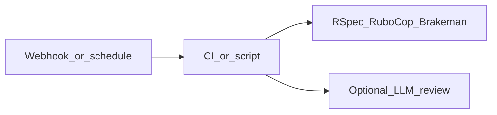

# Suggestions: agents vs additional skills

You already cover most **on-demand** workflows under `[.claude/skills/](.claude/skills/)` (see table in `[CLAUDE.md](CLAUDE.md)`). Below: what to automate with **agents** (infrastructure + triggers) and what to add as **new skills** (playbooks in the repo).

---

## Part A — “Agents” (automation; not `SKILL.md` files)

These are **event-driven or scheduled systems** that run tools and optionally call an LLM. Skills stay the **instructions**; the agent is the **runner + trigger**.

| Idea                       | Trigger                                              | What runs                                                                                                  | Fits Customer Pulse because                                                                                                                                  |
| -------------------------- | ---------------------------------------------------- | ---------------------------------------------------------------------------------------------------------- | ------------------------------------------------------------------------------------------------------------------------------------------------------------ |
| **PR gate agent**          | `pull_request` (GitHub Actions)                      | `bundle exec rspec`, `bin/rubocop`, `bin/brakeman`                                                         | You already have `[.github/workflows/ci.yml](.github/workflows/ci.yml)` with lint + Brakeman; extend with **RSpec job** if you want full parity on every PR. |
| **PR review bot**          | PR opened / updated                                  | Same tests, then optional **LLM review** (Anthropic API or hosted bot) using a short prompt + diff summary | Keeps humans in the loop; skill text can define **review rubric** (security, webhooks, PII).                                                                 |
| **Stale / size bot**       | Schedule or PR event                                 | Labels large PRs, nudges missing description                                                               | Cheap process win; no LLM required.                                                                                                                          |
| **Deploy / release notes** | Tag or merge to `main`                               | Generate changelog from conventional commits or PR titles                                                  | Optional; pairs with **customer-documentation** skill for wording.                                                                                           |
| **Log / error triage**     | Sentry, Datadog, PagerDuty, or **log drain** webhook | Alert → ticket or **one-shot** Claude session with an “incident” skill                                     | Skills don’t **watch** logs; observability + alert does.                                                                                                     |
| **Dependency update bot**  | Weekly                                               | Dependabot / Renovate + CI                                                                                 | Rails + JS deps; run tests automatically.                                                                                                                    |

**Pattern:** Implement triggers in **GitHub Actions** (or your host’s equivalent). Optionally add a **single doc** in-repo (e.g. `docs/agents.md`) describing *what* runs on *which* event—without conflating that with Claude Code skills.

---

## Part B — Additional skills worth adding (gaps vs current set)

These are **new `SKILL.md` folders** you do **not** have yet; each is one focused playbook.

| Skill name (kebab-case)          | Why add it                                                                                                                                                             |
| -------------------------------- | ---------------------------------------------------------------------------------------------------------------------------------------------------------------------- |
| `**security-pii-review`**        | Webhooks + feedback + email = **PII** and **secret** risk; structured checklist (logging, retention, redaction, `lockbox`). Complements `webhooks-integration-safety`. |
| `**incident-triage-production`** | When alerts fire: where to look (`/sidekiq`, logs, Redis), **safe** rollback story, communication template. Pairs with log-monitoring *agents* above.                  |
| `**dependency-upgrade-rails`**   | Major/minor Rails/gem upgrades: order of operations, deprecation warnings, `rails app:update` cautions.                                                                |
| `**performance-n-plus-one**`     | Bullet / `rack-mini-profiler` patterns, `includes`/`preload` on feedback queries, job batch sizes.                                                                     |
| `**multi-tenant-or-authz**`      | If you add teams/roles beyond `admin?`: policies, scoping feedback by account. Skip until you need it.                                                                 |
| `**feature-flag-rollout**`       | If you introduce Flipper or similar: gradual rollout checklist. Skip until flags exist.                                                                                |

**Lower priority** (only if you feel repetition in sessions):

- `**commit-message-conventions`** — Conventional commits or team format.
- `**backfill-data-migration**` — Separate from schema migrations: batched `update_all`, throttling, idempotency.

---

## Part C — What you probably should *not* duplicate

- **“Agent that runs tests”** — Already covered by CI + `[test-and-ci-gate](.claude/skills/test-and-ci-gate/SKILL.md)`; extend **GitHub Actions** instead of a second skill.
- **“Agent that critiques PRs”** — Use **CI + optional LLM step**; keep a **short skill** only if you want a **fixed review checklist** the bot prompt references.

---

## Suggested priority order

1. **Automation:** Add **RSpec to CI** on PRs if not already (align with local `test-and-ci-gate`).
2. **Skill:** `**security-pii-review*`* (high leverage for your domain).
3. **Automation:** **Error tracking** (Sentry or similar) + runbook link to a future `**incident-triage-production`** skill.
4. **Skill:** `**incident-triage-production`** once you have real production paths and dashboards.

No repo edits are required for this plan—it is a recommendation list only.