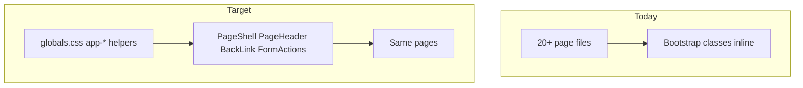

# Standard UI/UX across Customer Pulse (Next.js web)

## Current state (audit summary)

- **Stack**: [apps/web/package.json](apps/web/package.json) — Bootstrap 5.3, react-bootstrap, Tailwind **utilities only** (no preflight; see [apps/web/src/app/globals.css](apps/web/src/app/globals.css)).
- **Theming**: Monochrome tokens already override `--bs-primary`, links, alerts, and nav pills in `globals.css`. Cards use `shadow-sm` + `border-secondary-subtle` in places.
- **Gaps**:
  - **No shared layout components** — each page picks its own `h1`/`h3`, `mx-auto` max-width (`28rem`–`42rem`), and spacing.
  - **Back navigation** is ad hoc: [`small link-primary`](apps/web/src/app/app/projects/[id]/edit/page.tsx) plus Unicode arrows (`←`) and inconsistent labels (“Projects”, “Back to project”, “Integrations”, etc.). That reads as generic and visually weak next to real buttons.
  - **Forms** mix raw `<form>` + Bootstrap classes and occasional `Form`/`Card` from react-bootstrap ([LoginForm.tsx](apps/web/src/app/login/LoginForm.tsx)); submit rows don’t share alignment or spacing rules.
  - **Buttons**: Correct Bootstrap variants but **sizes and grouping differ** (e.g. onboarding has long rows of `btn-outline-secondary` + `btn-primary` without a shared footer pattern).

## Design direction (standard)

Stay on **Bootstrap + existing monochrome tokens** so the app keeps one visual language.

| Element | Standard |
|--------|----------|
| **Page frame** | `PageShell` with width: `narrow` (~32rem), `medium` (~40–42rem), `wide` (~56rem), `full` (no max) — matches today’s inline `maxWidth` usages. |
| **Page title** | One pattern: optional **back** row, then **title** (`h1` with `h3` visual size or fixed `h3` everywhere — pick **one** and document it), optional **description** line, optional **actions** (e.g. “Add …” button) on the right on `md+`. |
| **Back control** | `BackLink` component: `Link` + **inline SVG chevron** (no new icon font dependency), muted text, clear hover/focus, accessible name e.g. “Back to Projects”. Avoid Unicode arrows in copy. |
| **Primary / secondary actions** | Primary: `btn btn-primary`; secondary: `btn btn-outline-secondary`; toolbar / dense lists: `btn-sm`; destructive: keep existing `btn-link` + `text-danger` or `btn-outline-danger` where already used. |
| **Forms** | `FormActions`: consistent `d-flex flex-wrap gap-2` row (e.g. submit aligned start or end per page type); long settings-style pages keep **Card + card-body** with the same padding. |
| **Alerts / notices** | Keep `alert alert-*` + `small py-2`; optional wrapper class only if spacing needs unifying. |

## Implementation plan

### 1. Add UI primitives (new files under `apps/web/src/components/ui/`)

Suggested files (names can be adjusted, but keep **one folder**):

- **`BackLink.tsx`** — props: `href`, `label` (visible text after icon, e.g. “Projects”), optional `className`. Renders icon + text; uses `next/link`. Include short comments (you’re learning-oriented).
- **`PageHeader.tsx`** — props: `title`, optional `description`, optional `back={{ href, label }}`, optional `actions` (`ReactNode`). Server-component friendly (no hooks).
- **`PageShell.tsx`** — props: `width`, `className`, `children`; applies max-width + horizontal margin + optional vertical rhythm (`gap-4` / `mb-4` conventions).
- **`FormActions.tsx`** — props: `children`, optional `align` (`start` | `end`); standardizes footer spacing for forms.

**CSS**: In [apps/web/src/app/globals.css](apps/web/src/app/globals.css), add a small **`.app-back-link`** (or similar) block for focus/hover that complements Bootstrap—no duplicate theme system.

### 2. Apply across pages (mechanical migration)

Replace inline back `Link`s and title blocks with `PageShell` + `PageHeader` + `BackLink` where applicable.

**High-priority (back + narrow forms)** — ~12 files, including:

- [apps/web/src/app/app/projects/new/page.tsx](apps/web/src/app/app/projects/new/page.tsx), `[id]/page.tsx`, `[id]/edit/page.tsx`, `[id]/members/page.tsx`
- [apps/web/src/app/app/integrations/new/page.tsx](apps/web/src/app/app/integrations/new/page.tsx), `[id]/page.tsx`, `[id]/edit/page.tsx`
- [apps/web/src/app/app/feedback/[id]/page.tsx](apps/web/src/app/app/feedback/[id]/page.tsx)
- [apps/web/src/app/app/pulse-reports/[id]/page.tsx](apps/web/src/app/app/pulse-reports/[id]/page.tsx)
- [apps/web/src/app/app/recipients/new/page.tsx](apps/web/src/app/app/recipients/new/page.tsx), `[id]/edit/page.tsx`
- [apps/web/src/app/app/skills/new/page.tsx](apps/web/src/app/app/skills/new/page.tsx), `[id]/edit/page.tsx`

**List / dashboard pages** — use `PageHeader` without back; align “Add …” / filters into `actions` or a consistent sub-row:

- [apps/web/src/app/app/page.tsx](apps/web/src/app/app/page.tsx), [feedback/page.tsx](apps/web/src/app/app/feedback/page.tsx), [integrations/page.tsx](apps/web/src/app/app/integrations/page.tsx), [projects/page.tsx](apps/web/src/app/app/projects/page.tsx), [recipients/page.tsx](apps/web/src/app/app/recipients/page.tsx), [skills/page.tsx](apps/web/src/app/app/skills/page.tsx), [pulse-reports/page.tsx](apps/web/src/app/app/pulse-reports/page.tsx), [settings/page.tsx](apps/web/src/app/app/settings/page.tsx)

**Onboarding** — [apps/web/src/app/app/onboarding/page.tsx](apps/web/src/app/app/onboarding/page.tsx): unify **button rows** (Back / Continue / Skip) with a shared layout component or `FormActions`-style flex row so every step matches; keep server actions as-is.

**Login** — [apps/web/src/app/login/LoginForm.tsx](apps/web/src/app/login/LoginForm.tsx) / [login/page.tsx](apps/web/src/app/login/page.tsx): optional light touch (e.g. same card shadow / spacing tokens) without forcing `PageShell` if it fights the centered layout.

**Embedded forms** — [ProjectForm.tsx](apps/web/src/app/app/projects/ProjectForm.tsx) and similar: wrap submit area with `FormActions`.

**Pagination** — [feedback/page.tsx](apps/web/src/app/app/feedback/page.tsx), [pulse-reports/page.tsx](apps/web/src/app/app/pulse-reports/page.tsx): replace “← Previous” text links with **`btn btn-sm btn-outline-secondary`** (or a tiny `PaginationNav` component) so pagination matches the rest of the UI.

### 3. Sidebar polish (optional but high leverage)

[apps/web/src/app/app/layout.tsx](apps/web/src/app/app/layout.tsx): `Link` nav items don’t reflect the active route. A small **client** `NavLink` (using `usePathname`) can highlight the current section—fits “standard UX” and is low risk if scoped to the sidebar only.

### 4. Quality gate

- `yarn workspace web lint` and `yarn build:web` from repo root.
- Manual pass: open representative routes (dashboard, feedback list + detail, integration edit, onboarding step, settings) in light/dark theme.

## Out of scope (unless you want to expand later)

- Replacing Bootstrap with shadcn/Radix or a full design system.
- Changing copy/product flows beyond consistent labels for back links.
- Mobile-specific sidebar patterns (drawer) — not required for this pass.

## Risk / note

Do **not** commit `.env` or `.env.local`; your tree shows untracked env files under `apps/web/` — keep them out of git when merging this work.
