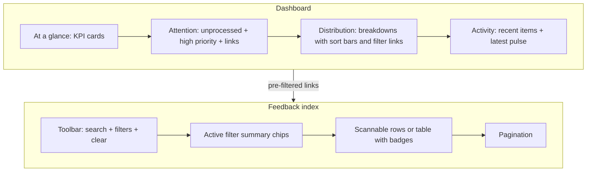

# Dashboard & feedback UX/UI audit and improvement plan

## Current implementation (baseline)

| Surface | Entry | Stack |
|--------|--------|--------|
| Dashboard | [`apps/web/src/app/app/page.tsx`](apps/web/src/app/app/page.tsx) | Server component, `PageShell` full width, inline `StatCard` / `Breakdown` helpers |
| Feedback index | [`apps/web/src/app/app/feedback/page.tsx`](apps/web/src/app/app/feedback/page.tsx) | GET filters + pagination, bulk update form, `list-group` rows |
| Feedback detail | [`apps/web/src/app/app/feedback/[id]/page.tsx`](apps/web/src/app/app/feedback/[id]/page.tsx) | `PageShell` wide, metadata `dl`, cards for content / AI / edit |

Shared chrome: [`PageHeader`](apps/web/src/components/ui/PageHeader.tsx), [`PageShell`](apps/web/src/components/ui/PageShell.tsx), sidebar IA in [`apps/web/src/app/app/layout.tsx`](apps/web/src/app/app/layout.tsx) (Dashboard + Feedback under “Work”).

---

## Audit: what works

- **Consistent shell**: Same header pattern and Bootstrap cards/list-groups across pages.
- **Feedback list** already supports **filters** (`buildFeedbackConditions` + URL query params), **search**, **pagination** ([`PaginationNav`](apps/web/src/components/ui/PaginationNav.tsx)), and **bulk actions** for editors.
- **Detail page** separates **read content** from **triage forms** and exposes **AI summary** when present.
- **Dashboard queries** are purposeful: totals, recency, unprocessed AI count, four breakdown dimensions, recent + high-priority slices, latest pulse.

---

## Audit: UX and UI gaps

### Dashboard

1. **Flat hierarchy** — After the four stat cards, breakdown cards and lists share similar visual weight. There is no clear “start here” for triage (e.g. unprocessed + high priority + deep links).
2. **High-priority list shows raw enums** — Subtitle uses `P{f.priority} · status {f.status}` instead of the same human labels as elsewhere ([`FEEDBACK_STATUS_LABELS`](apps/web/src/lib/feedback-enums-display.ts)), which hurts trust and scan speed.
3. **Breakdowns are not actionable** — Rows are plain text + count with no navigation to a pre-filtered feedback list (users must re-apply filters manually).
4. **Breakdown lists are unsorted** — SQL `groupBy` order makes it hard to see “top buckets” at a glance; no bar or percentage for proportion.
5. **Header description is dense** — Project name, slug, and “signed in as email” duplicate information already shown in the sidebar ([`apps/web/src/app/app/layout.tsx`](apps/web/src/app/app/layout.tsx)).
6. **Latest pulse** is easy to miss — Single paragraph below two columns; could be grouped with “reports” or given a compact card like stats.

### Feedback index

1. **Metadata is one long sentence** — `#id · time · source · category · priority · status` in a single line forces linear reading; hard to compare rows.
2. **No visual encoding** — Priority/status/source are equally styled; badges or color tokens (used sparingly, e.g. priority only) would speed scanning.
3. **Filter UX** — Submitting “Filter” full-page reload is fine for RSC, but **active filters are not surfaced as removable chips** above the list, so context is easy to lose.
4. **Bulk bar** — Useful but visually similar to the filter card; editors may confuse the two regions without stronger labels or placement (e.g. toolbar directly above the list).
5. **Accessibility** — The list is not structured as a table; screen-reader users get less predictable column semantics than a `<table>` with `<th scope="col">` (optional improvement).

### Feedback detail

1. **Two similar triage forms** (“Edit” vs “Quick override”) — Copy explains the difference, but the UI still presents two parallel forms; this increases cognitive load for new users.
2. **No prev/next in queue** — Common triage flow is list → detail → next item; today users must return to the list each time.
3. **Metadata grid** — `dl` with `row-cols-*` is acceptable but wrapping can feel uneven on medium widths; a compact “summary strip” (badges + key dates) often reads faster.

---

## Recommended information architecture

Treat both pages as answering three questions in order: **How much?** → **What needs attention?** → **Where to drill in?**

---

## Plan: structured, accessible presentation

### Phase 1 — Quick wins (low risk, high clarity)

- **Dashboard**
  - Fix high-priority row subtitles to use **the same labels** as the feedback list/detail (`FEEDBACK_STATUS_LABELS`, `FEEDBACK_PRIORITY_LABELS`).
  - **Reorder and label sections** with short `h2` + optional one-line helper text: e.g. “Needs attention”, “Volume & mix”, “Recent activity”.
  - Add **links from each breakdown row** to `/app/feedback` with the matching query param (`category`, `status`, `priority`, `source` — align with existing [`buildFeedbackConditions`](apps/web/src/lib/feedback-filters.ts) / filter `name` attributes).
  - **Sort breakdown rows** by count descending (and optionally show a simple **horizontal bar** using a `progress` element or flex bar for proportion — pure CSS, no new deps).
  - Trim dashboard header: keep **project name** (and slug if useful); **drop duplicate email** from the subtitle or move to tooltip-only if you still want it.

- **Feedback index**
  - Replace the run-on metadata line with a **row layout**: title + 2-line body preview unchanged; second line becomes **badge group** (Bootstrap `badge` / `text-bg-*` sparingly for priority) for source, category, priority, status.
  - Render **active filter summary** above the list (read from `searchParams`): e.g. “Category: Bug” with a link to URL minus that param — reuses existing query building pattern already in the page.

### Phase 2 — Layout and triage flow

- **Dashboard**
  - Optional **two-column “above the fold”**: left column = stats + attention block; right = top breakdowns or recent — reduces scroll on large screens.
  - **Pulse report**: small **card** with period dates (if available) + primary link, consistent with stat cards.

- **Feedback index**
  - **Responsive table** on `md+** with `<table class="table table-hover align-middle">` and card-style stacked layout on small screens *or* keep list-group but add **synthetic column headers** (visually hidden or visible) for accessibility.
  - **“Select all on this page”** for bulk edit (client component or minimal JS — only if you accept a small client island; otherwise document as follow-up).

- **Feedback detail**
  - **Prev/next**: server-side compute previous/next IDs for the same project ordered by `createdAt desc` (respecting optional `return` query from list filters later if you want parity).
  - **Consolidate triage**: single **“Triage”** card with one save path; keep “Re-run AI” and optionally demote “override” to an advanced disclosure — reduces duplicate forms.

### Phase 3 — Polish (optional)

- **Saved views** or URL-bookmarkable filter sets (no DB): document “bookmark this filtered URL” in UI copy.
- **Empty states** with one primary CTA (e.g. “Connect an integration”, link to `/app/integrations`) when `total === 0` on dashboard or feedback.
- **KPI context**: e.g. “+12 vs prior 7 days” requires extra queries — only if product asks for trends.

---

## Files likely to change

| Change | Files |
|--------|--------|
| Dashboard structure, breakdown links, sorting | [`apps/web/src/app/app/page.tsx`](apps/web/src/app/app/page.tsx) |
| Feedback list badges, filter chips | [`apps/web/src/app/app/feedback/page.tsx`](apps/web/src/app/app/feedback/page.tsx) |
| Shared badge / meta row (DRY) | New small component under e.g. [`apps/web/src/components/feedback/`](apps/web/src/components/) |
| Detail triage / prev-next | [`apps/web/src/app/app/feedback/[id]/page.tsx`](apps/web/src/app/app/feedback/[id]/page.tsx), possibly [`apps/web/src/app/app/feedback/actions.ts`](apps/web/src/app/app/feedback/actions.ts) (unchanged if only navigation) |
| Styles | [`apps/web/src/app/globals.css`](apps/web/src/app/globals.css) only if you add narrow utilities (e.g. breakdown bars) |

---

## Success criteria (how you’ll know it worked)

- Users can answer **“what should I look at first?”** without reading the whole dashboard.
- **One click** from a dashboard bucket to the **matching filtered feedback list**.
- Feedback rows are **scannable in &lt;2 seconds** (badges / columns vs one long string).
- Detail page supports **linear triage** (next item) without returning to the list every time.
- No regression in **existing filter/bulk** behavior; keyboard and screen-reader labels remain explicit for form controls.
