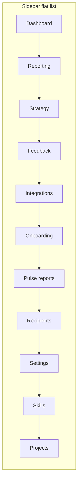

# Information architecture: nav and page structure

## Where navigation is defined

The sidebar order is a single array in [apps/web/src/app/app/layout.tsx](apps/web/src/app/app/layout.tsx) (lines 13–24), rendered by [apps/web/src/components/SidebarNav.tsx](apps/web/src/components/SidebarNav.tsx). There is no grouping (no section headers or dividers)—everything is one flat list plus optional **Job queue (admin)**.

Current order:

1. Dashboard  
2. Reporting  
3. Strategy  
4. Feedback  
5. Integrations  
6. Onboarding  
7. Pulse reports  
8. Recipients  
9. Settings  
10. Skills  
11. Projects  

The layout comment says links “mirror Rails resources”; that explains historical order more than task-based IA.

---

## Sidebar order: assessment

**What works**

- **Dashboard first** matches the usual “home” pattern.  
- **Projects last** is tolerable because [ProjectSwitcher](apps/web/src/app/app/ProjectSwitcher.tsx) already handles the common case (switch workspace); the Projects page is more “manage all workspaces.”  
- **Skills at the bottom** is appropriate if the audience is mostly operators—Skills are Claude/sync-oriented and read as power-user.

**Friction / mismatches**

| Issue | Why it matters |
|--------|----------------|
| **Reporting before Feedback** | Reporting ([apps/web/src/app/app/reporting/page.tsx](apps/web/src/app/app/reporting/page.tsx)) is analytics over a chosen window; Feedback is the primary operational surface. Users who live in the inbox may expect Feedback immediately after Dashboard. |
| **Strategy between Reporting and Feedback** | Strategy ([apps/web/src/app/app/strategy/page.tsx](apps/web/src/app/app/strategy/page.tsx)) is internal planning text, weakly related to “reporting” as charts. It could sit next to Settings or after Feedback depending on whether you want “read feedback → decide strategy” or “configure → work.” |
| **Onboarding in the middle of the list** | For users who already finished onboarding, `/app/onboarding` **redirects to `/app`** ([onboarding/page.tsx](apps/web/src/app/app/onboarding/page.tsx) lines 23–25). The nav label still looks like a destination but acts like a no-op—confusing IA. |
| **Pulse reports, Recipients, and Reporting are separated** | All touch “what we communicate / digest / analyze,” but the nav spreads them (Reporting early, Pulse reports + Recipients later). Users may not connect Recipients to Pulse reports without copy or grouping. |

**Optional directions** (choose based on primary persona: *insights-first* vs *inbox-first*)

- **Inbox-first:** Dashboard → Feedback → Pulse reports → Reporting → Strategy → Integrations → Recipients → Settings → Skills → Projects; drop or relocate **Onboarding** (e.g. only while incomplete, or under Settings as “Setup guide”).  
- **Insights-first:** Keep Reporting high; still consider moving **Onboarding** and clustering **Pulse reports + Recipients**.

---

## Page content order: assessment

### Dashboard ([apps/web/src/app/app/page.tsx](apps/web/src/app/app/page.tsx))

- Flow: **PageHeader → stat cards → four breakdowns → recent + high-priority lists → latest pulse link.**  
- **Verdict:** Coherent summary-to-detail story. If the product’s hero outcome is the email digest, you could test moving “Latest pulse report” higher; not required for correctness.

### Reporting ([apps/web/src/app/app/reporting/page.tsx](apps/web/src/app/app/reporting/page.tsx))

- Flow: **Header → time-range toggles → KPI row → volume line chart → four bar breakdowns → top themes / recent insights → NL assistant → recent questions history.**  
- **Verdict:** Logical “set context → visualize → drill → ask → history.” NL assistant after charts assumes users scan charts before asking; reasonable.

### Feedback index ([apps/web/src/app/app/feedback/page.tsx](apps/web/src/app/app/feedback/page.tsx))

- Flow: **Header → alerts → filter form → bulk update bar (if allowed) → list → pagination.**  
- **Verdict:** Standard list UX. Filters before the list is correct.

### Feedback detail ([apps/web/src/app/app/feedback/[id]/page.tsx](apps/web/src/app/app/feedback/[id]/page.tsx))

- Flow: **Header → triage metadata grid → content card → AI summary (if any) → edit / override / reprocess.**  
- **Verdict:** Read-first, then act. “Edit” and “Quick override” overlap conceptually; that is a product simplification opportunity, not strictly ordering.

### Strategy ([apps/web/src/app/app/strategy/page.tsx](apps/web/src/app/app/strategy/page.tsx))

- Flow: **Alerts → business objectives/strategy card → teams card (create form, then list).**  
- **Verdict:** Top-down (business then teams) matches the domain.

### Pulse report detail ([apps/web/src/app/app/pulse-reports/[id]/page.tsx](apps/web/src/app/app/pulse-reports/[id]/page.tsx))

- Flow: **Header → resend / notices → feedback in period → “Recent insights” → idea sections.**  
- **Issue:** “Recent insights” is populated with `insights` filtered by **project only**, ordered by `createdAt`, not constrained to the report’s `periodStart`/`periodEnd` (see query around lines 76–85). The section title implies recency for the **report period**, but the data is **project-wide recent insights**.  
- **Verdict:** Section order is fine; **labeling (and/or query scope) should align** so users are not misled.

### Settings ([apps/web/src/app/app/settings/page.tsx](apps/web/src/app/app/settings/page.tsx))

- Flow: **General read-only defaults → GitHub integration form.**  
- **Verdict:** Sensible; general context before the one editable block.

### Projects show ([apps/web/src/app/app/projects/[id]/page.tsx](apps/web/src/app/app/projects/[id]/page.tsx))

- Flow: **Header + actions → description → stat cards.**  
- **Verdict:** Minimal hub page; order is fine.

### Minor label consistency

- Sidebar: **Recipients** vs page title **Email recipients** ([recipients/page.tsx](apps/web/src/app/app/recipients/page.tsx))—small naming drift.

---

## Diagram (current high-level IA)

---

## Recommended follow-ups (if you implement later)

1. **Onboarding:** Hide the nav item when `onboardingCompletedAt` is set, or rename/move to “Setup guide” under Settings so the sidebar matches behavior.  
2. **Pulse report detail:** Rename section (e.g. “Latest project insights”) or filter insights by report period—pick one and match copy to data.  
3. **Nav order:** Reorder using either inbox-first or insights-first model; optionally add visual grouping (e.g. “Work,” “Outputs,” “Setup”) without changing routes.

No code changes were made in this pass; this is analysis only.
