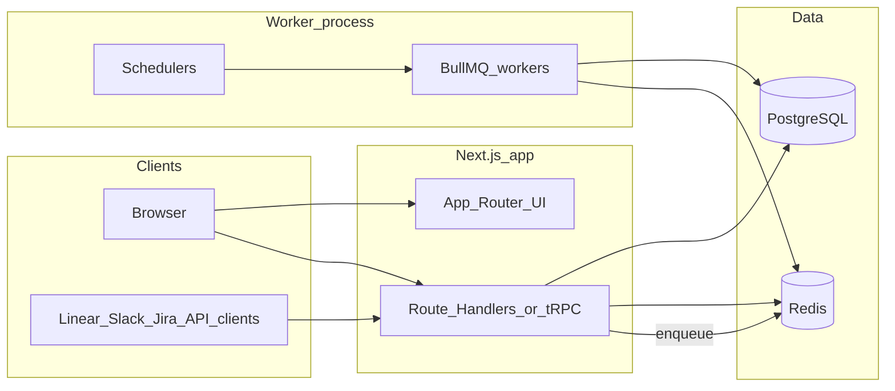

# Full-stack migration to Next.js (TypeScript)

## What you are migrating (inventory)

The current app is a **monolithic Rails 8** product with a **thin Hotwire front end** ([`package.json`](package.json): Stimulus, Turbo, Tailwind via CLI) and **heavy server-side domain logic**.

| Area | Location / notes |
|------|------------------|
| **HTTP surface** | [`config/routes.rb`](config/routes.rb): Devise + Google OAuth, dashboard, projects/members, onboarding, feedback (index/show/update, bulk, override, reprocess), integrations (sync/test), email recipients, settings (GitHub), pulse reports, skills; [`api/v1/feedback`](app/controllers/api/v1/feedback_controller.rb); webhooks Linear/Slack/Jira; health `up`; Sidekiq Web (admin) |
| **Data model** | [`db/schema.rb`](db/schema.rb): ~15 core tables (users, projects, project_users, feedbacks, integrations with Lockbox ciphertext, insights/themes/ideas graph, pulse_reports, email_recipients, repo_analyses, skills, pm_personas, stakeholder_segments, join tables) |
| **Background work** | [`app/jobs/`](app/jobs/) (~20 jobs) + [`config/sidekiq_schedule.yml`](config/sidekiq_schedule.yml): AI batch processing, many integration syncs (Slack every minute, others every 15–30 min), daily email, insight/theme/attack-group pipelines |
| **Integrations & AI** | [`app/services/integrations/`](app/services/integrations/), [`app/services/ai/`](app/services/ai/), Anthropic, GitHub PR flows, [`app/services/pulse_generator.rb`](app/services/pulse_generator.rb) |
| **Email** | [`app/mailers/pulse_mailer.rb`](app/mailers/pulse_mailer.rb) |
| **Auth** | Devise + OmniAuth Google; roles `viewer` / `admin` ([`app/models/user.rb`](app/models/user.rb)) |

A “Next.js-only” rewrite therefore means **reimplementing almost everything except the database engine** (PostgreSQL can stay; schema and data migrate in place or via careful cutover).

---

## Target architecture (recommended shape)

- **Next.js (App Router)**: marketing/auth pages, authenticated app UI, and **short** API handlers (CRUD, session checks, enqueue jobs).
- **Worker process(es)**: long-running sync, Anthropic calls, batching, email sends—**not** on Vercel’s default serverless timeouts unless you split into step functions / external compute.
- **PostgreSQL**: keep as system of record; map enums and JSONB columns explicitly in the ORM layer.
- **Redis**: job queues + (optional) rate-limit/session if you choose that pattern.

**Hosting implication (important):** If you deploy the Next app on **Vercel**, treat **workers as a separate long-lived Node service** (Railway, Fly.io, ECS, etc.) running BullMQ consumers + schedulers, sharing the same `DATABASE_URL` and `REDIS_URL`. Alternatively, **self-host Next + workers** on one platform (e.g. Docker Compose / k8s) to simplify ops.

---

## Stack choices (concrete defaults)

These are common, well-supported pairings; adjust to team preference.

| Concern | Suggested TS stack |
|--------|---------------------|
| ORM + migrations | **Drizzle** or **Prisma** (both work with existing Postgres; you will translate Rails migrations into TS migrations) |
| Auth | **Auth.js (NextAuth v5)** with Google provider + credentials; store sessions in DB or JWT; **replicate** [`from_omniauth`](app/models/user.rb) link-by-email behavior for Google account linking |
| Password hashing | **bcrypt** with compatible cost so existing `encrypted_password` can be verified—or force password reset on cutover (document the choice) |
| Jobs / cron | **BullMQ** + `bullmq` repeatable jobs mirroring [`config/sidekiq_schedule.yml`](config/sidekiq_schedule.yml) |
| Encryption (Lockbox) | Port **Lockbox-compatible** decryption/encryption in Node (same master key env) or **re-encrypt** during migration; critical for [`integrations.credentials_ciphertext`](db/schema.rb) |
| Email | **React Email** + transactional provider (Resend/Postmark/SendGrid); port [`pulse_mailer`](app/mailers/pulse_mailer.rb) templates |
| AI | Official **Anthropic** Node SDK; port prompts and flow from [`app/services/ai/`](app/services/ai/) |
| HTTP to third parties | Typed clients per integration (fetch/axios), shared retry/backoff policy |
| Admin queue UI | **Bull Board** (or similar) mounted on a **protected** admin route, replacing Sidekiq Web |
| Testing | **Vitest** (unit), **Playwright** (e2e), contract tests for webhooks and `POST /api/v1/feedback` |

---

## Phased execution plan

### Phase 0 — Decisions and scaffolding (1–2 weeks)

- Lock **repo layout**: monorepo (`apps/web`, `packages/db`, `packages/worker`) vs two repos.
- Define **deployment**: Next host + worker host + managed Postgres/Redis.
- Produce a **route parity matrix** from [`config/routes.rb`](config/routes.rb) (every authenticated action, webhook path, public API).
- Document **env vars** from [`.env.example`](.env.example) / README and map to Next/worker processes.

### Phase 1 — Database and domain layer (2–4 weeks)

- Import schema into Drizzle/Prisma; align **Rails enums** (`source`, `category`, `priority`, `status`, `role`, integration `source_type`, etc.) with TS unions or lookup tables.
- Implement **repositories** or query modules per aggregate (Feedback, Project, Integration, User) before UI.
- Plan **password/OAuth parity**: reading existing Devise bcrypt fields vs migration window.

### Phase 2 — Authentication and authorization (2–3 weeks)

- Implement Auth.js with Google + email/password matching current flows.
- **Project switching** and `project_users` membership checks on every data API (mirror [`authenticate :user`](config/routes.rb) + any controller `before_action` patterns).
- **Admin-only** paths (Sidekiq replacement, dangerous operations) gated on `role === admin`.

### Phase 3 — Public and webhook surfaces (high risk, early)

- **`POST /api/v1/feedback`**: match validation, `custom` source, optional `external_id`, idempotency if you add it (recommended for integrators).
- **Webhooks** ([`webhooks/linear`, `slack`, `jira`](config/routes.rb)): raw body for signature verification, idempotent processing, same dedupe keys as Rails (`source` + `source_external_id` unique index on [`feedbacks`](db/schema.rb)).
- Add **request specs** (supertest or similar in worker/API package) before relying on them in production.

### Phase 4 — Core app UI (parallelizable, 4–8+ weeks)

Rebuild pages against new API handlers, mirroring current resources:

- Dashboard, projects + members, onboarding wizard (step updates + connection tests from [`onboarding_controller`](app/controllers/onboarding_controller.rb)), feedback list/detail/bulk actions, integrations UI, recipients, settings/GitHub, pulse reports, skills.

Use **TanStack Query** (or RSC + server actions where appropriate) for data fetching; replace Turbo/Stimulus behaviors explicitly.

### Phase 5 — Worker port (long pole, 6–12+ weeks)

For each job in [`app/jobs/`](app/jobs/), port logic from the job + underlying service:

1. Define **job payload** types and **idempotency** (safe retries).
2. Map cron from [`config/sidekiq_schedule.yml`](config/sidekiq_schedule.yml) to BullMQ repeatable jobs with the **same** cadence initially to avoid behavior drift.
3. Order suggestion (dependencies first):  
   - `ProcessFeedbackBatchJob` / `ProcessFeedbackJob` + [`Ai::FeedbackProcessor`](app/services/ai/feedback_processor.rb)  
   - Integration sync jobs + clients under [`app/services/integrations/`](app/services/integrations/)  
   - `GenerateInsightsJob`, `WeeklyThemeAnalysisJob`, `BuildAttackGroupsJob` + [`insights/orchestrator`](app/services/insights/orchestrator.rb)  
   - `SendDailyPulseJob` + [`pulse_generator`](app/services/pulse_generator.rb)  
   - GitHub PR jobs + [`github/`](app/services/github/)

**Slack sync every minute** and **15-minute pollers** will stress **API quotas and DB writes**—add metrics and backoff like production Rails.

### Phase 6 — Email and reporting parity (1–2 weeks)

- Port digest content and recipient selection to match [`SendDailyPulseJob`](app/jobs/send_daily_pulse_job.rb) behavior.
- Verify timezone handling for “9 AM” cron vs user/project expectations.

### Phase 7 — Cutover, observability, and decommission

- **Dual-write or read-only freeze** window: stop Rails workers, run TS workers only, or run both with strict idempotency (hard).
- **Sentry** (or equivalent) in Next + worker; structured logging with correlation IDs across API → queue → integration.
- **Load/chaos checks** on webhook volume and AI batch cost.
- Decommission Rails app, Sidekiq, and old CI jobs after parity sign-off.

---

## Non-obvious pitfalls (plan for these explicitly)

1. **Lockbox ciphertext**: Node must read/write credentials identically to Rails [`Integration`](app/models/integration.rb) or you will break all integrations at cutover.
2. **Webhook raw bodies**: Signature algorithms often require the **unparsed** body; Next Route Handlers must not consume/alter it before verification (same issue as [`webhooks/base_controller`](app/controllers/webhooks/base_controller.rb) patterns).
3. **Serverless limits**: Anthropic and large sync jobs belong in **workers**, not in default Vercel functions.
4. **Enum/int mapping**: Rails stores integers; TS layer must use the **same** values as ActiveRecord enums.
5. **Sidekiq Web**: Replace with a **secured** Bull Board; do not expose Redis or admin UIs publicly.

---

## Effort and team shape (order-of-magnitude)

For a **full TS rewrite** of this surface area (multi-integration product + AI + email + webhooks), expect **many person-months** (often **6–12+ calendar months** for a small team), highly dependent on how much behavior is ported line-for-line vs simplified.

**Suggested team split:** 1–2 engineers on **data/auth/API/webhooks**, 1–2 on **workers/integrations/AI**, 1 on **Next UI**, with shared ownership of encryption and idempotency.

---

## What “done” looks like

- All routes in [`config/routes.rb`](config/routes.rb) have equivalents or an intentional deprecation list.
- Cron coverage matches [`config/sidekiq_schedule.yml`](config/sidekiq_schedule.yml).
- Public API and webhooks pass **contract tests** and a **shadow period** against production-like traffic (if feasible).
- No Rails processes in production; PostgreSQL is the same or migrated with verified row counts and checksums on critical tables.
