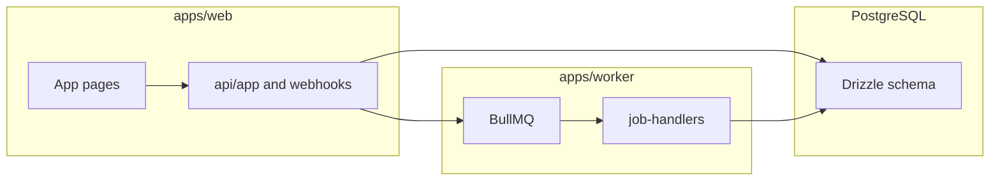

# Plan: Restore full app parity with Rails

## What exists today (baseline)

| Area | Status |
|------|--------|
| Auth | Working: [`apps/web/src/auth.ts`](apps/web/src/auth.ts) (credentials + optional Google), [`/login`](apps/web/src/app/login/page.tsx) |
| App shell | Sidebar in [`apps/web/src/app/app/layout.tsx`](apps/web/src/app/app/layout.tsx); no project switcher |
| Dashboard | Placeholder only in [`apps/web/src/app/app/page.tsx`](apps/web/src/app/app/page.tsx) |
| Feedback | List-only, **all projects** the user belongs to—not **current project**—in [`apps/web/src/app/app/feedback/page.tsx`](apps/web/src/app/app/feedback/page.tsx); [`GET /api/app/feedbacks`](apps/web/src/app/api/app/feedbacks/route.ts) |
| Projects | List-only in [`apps/web/src/app/app/projects/page.tsx`](apps/web/src/app/app/projects/page.tsx); no show/edit/new/switch, no `/app/projects/[id]/members` |
| Onboarding, Integrations, Settings, Pulse reports, Recipients, Skills | Placeholder copy only (see e.g. [`apps/web/src/app/app/onboarding/page.tsx`](apps/web/src/app/app/onboarding/page.tsx)) |
| Public / inbound APIs | [`POST /api/v1/feedback`](apps/web/src/app/api/v1/feedback/route.ts) (queues `process_feedback`); Linear webhook is substantive in [`apps/web/src/app/api/webhooks/linear/route.ts`](apps/web/src/app/api/webhooks/linear/route.ts) |
| Worker | Repeatables registered in [`apps/worker/src/schedules.ts`](apps/worker/src/schedules.ts); **all handlers log-only** in [`apps/worker/src/job-handlers.ts`](apps/worker/src/job-handlers.ts) |

**Reference:** Route and enum mapping stays authoritative in [docs/next-migration/PARITY_MATRIX.md](docs/next-migration/PARITY_MATRIX.md). Rails behavior for each controller is still inspectable via `git show HEAD:app/controllers/...` (e.g. dashboard, feedback, onboarding).

---

## Critical gaps vs Rails (do these first)

### 1. Current project context

Rails stores `session[:current_project_id]`, scopes nearly all data to `current_project`, and uses `projects#switch` ([`ApplicationController` in git](https://github.com/)). The Next app **does not** have this: feedback aggregates every membership project, and the dashboard cannot match Rails’ per-project stats.

- **Implement:** httpOnly cookie (e.g. `current_project_id`) validated on each request against `project_users`; default to user’s first project when missing/invalid.
- **Expose:** Project switcher in [`app/layout.tsx`](apps/web/src/app/app/layout.tsx) (dropdown + “switch” action).
- **API pattern:** Shared helper e.g. `getCurrentProjectId()` used by server components and `/api/app/*` routes; return 400/403 if no project.

### 2. Onboarding gate

Rails redirects incomplete users to onboarding (`require_onboarding!` using `onboarding_completed_at`). Next has **no** equivalent ([`users` schema](packages/db/src/schema.ts) already has `onboardingCompletedAt` / `onboardingCurrentStep`).

- **Implement:** Next.js [`middleware`](https://nextjs.org/docs/app/building-your-application/routing/middleware) or a small guard in the `/app` layout that checks the user row and redirects to `/app/onboarding` until complete (with exceptions similar to Rails: allow onboarding routes, login, etc.).

### 3. Authorization helpers

Mirror Rails patterns from git:

- **`require_project_access!`** → user must be in `project_users` for `current_project_id`.
- **`require_project_owner!`** → `project_users.is_owner` (team management, project destroy, etc.).
- **`require_project_editor!`** → In HEAD this is referenced but not defined in `ApplicationController`; after migration `20260328114724_simplify_project_users_remove_roles`, treat **editor** as **any project member** unless you rediscover a different rule in history.

Centralize checks in a small module used by Route Handlers and server actions.

---

## Page-by-page parity checklist

### Dashboard (`/app`)

Rails [`DashboardController#index`](https://github.com/) (git): counts by category/priority/status/source, today/week/unprocessed counts, recent + high-priority lists, latest sent pulse report—all scoped to **current project**.

- **UI + queries:** Drizzle aggregations + limits on [`feedbacks`](packages/db/src/schema.ts), [`pulseReports`](packages/db/src/schema.ts).
- **Depends on:** current project cookie.

### Projects (`/app/projects`)

Rails: index, show (members + stats), new/create, edit/update, destroy, **switch**.

- **Add routes:** `/app/projects/new`, `/app/projects/[id]`, `/app/projects/[id]/edit`, POST switch (server action or route).
- **Members:** `/app/projects/[id]/members` matching `project_users#index|create|destroy` (owner-only for mutations); align with [PARITY_MATRIX](docs/next-migration/PARITY_MATRIX.md).

### Feedback (`/app/feedback` and `/app/feedback/[id]`)

Rails: paginated index with filters (`source`, `category`, `priority`, `status`, `q`), show, update, override, reprocess, bulk_update; mutations enqueue or update rows.

- **Scope all queries to current project** (behavior change from today’s cross-project list).
- **Add** detail route, forms or server actions for update/override, button to enqueue `process_feedback` with `{ feedbackId }` (same as v1 API).
- **Pagination:** replace `limit(100)` with query params or cursor (Pagy used ~20/page in Rails).

### Onboarding (`/app/onboarding`)

Rails [`OnboardingController`](https://github.com/): step list (`STEPS` constant), `update_step`, `test_connection`, `complete`, persists `onboarding_current_step` and creates/updates integrations, project, team, recipients, etc.

- **Implement** multi-step client wizard (or server-driven steps) calling new `/api/app/onboarding/*` or server actions.
- **Reuse** Lockbox patterns from [`/api/v1/feedback`](apps/web/src/app/api/v1/feedback/route.ts) for credential fields.

### Integrations (`/app/integrations`)

Rails: full CRUD per current project, `test_connection`, `sync_now`, `sync_all`—backed by Ruby clients under `app/services/integrations/`.

- **UI:** list/show/new/edit per integration row in [`integrations`](packages/db/src/schema.ts).
- **API:** encrypt credentials with [`packages/db` lockbox](packages/db/src/lockbox.ts); enqueue sync jobs by name (see PARITY_MATRIX job table).
- **Worker:** port HTTP clients + sync logic from Ruby (incremental: start with sources you use in prod).

### Settings (`/app/settings`)

Rails: `show`, `update` (generic settings), `save_github`, `test_github` against GitHub integration.

- **Persist** GitHub integration the same way as other integrations (`source_type` github).
- **Optional:** if Rails stored other settings outside `integrations`, locate `load_settings` in git `settings_controller.rb` and mirror storage (DB column vs JSON)—verify before implementing.

### Email recipients (`/app/recipients`)

Rails: full CRUD on [`emailRecipients`](packages/db/src/schema.ts) for current project.

- **Straightforward** CRUD pages + route handlers; editor vs viewer per Rails `before_action` lines.

### Pulse reports (`/app/pulse-reports`, `/app/pulse-reports/[id]`)

Rails: paginated index, rich show (report feedbacks, insights, ideas, PR status, polling), `generate`, `generate_pr`, `resend`.

- **Read path** can be built first (list/show from `pulse_reports` + related tables in schema).
- **Write path** depends on **`SendDailyPulseJob`** + **`pulse_generator`** + mailer parity and **`GenerateGithubPrJob`** in the worker—see below.

### Skills (`/app/skills`)

Rails: user-scoped CRUD; **writes `.claude/skills/<name>/SKILL.md`** on save/destroy.

- **Implement** same filesystem sync from Node (server-side only) when creating/updating/deleting rows in [`skills`](packages/db/src/schema.ts)—paths under repo `.claude/skills/` to match [Rails `Skill` model](https://github.com/) (git).

---

## API surface to add

Today only [`/api/app/feedbacks`](apps/web/src/app/api/app/feedbacks/route.ts) exists under `/api/app`. Plan to grow **authenticated JSON or server actions** along Rails resources, for example:

- `projects`, `project-users` (or nested), `integrations`, `feedback` (item + bulk), `onboarding`, `settings`, `email-recipients`, `pulse-reports` (generate/resend/pr).

Keep handlers thin; share Drizzle + auth + `current_project_id` validation.

---

## Worker / background parity (largest engineering chunk)

[`job-handlers.ts`](apps/worker/src/job-handlers.ts) must replace stubs with ports of:

- **AI:** `ProcessFeedbackJob`, `ProcessFeedbackBatchJob`, insight/theme jobs → Anthropic + [`packages/db`](packages/db/src/schema.ts) updates (see `.claude/skills/ai-feedback-pipeline/SKILL.md` when implementing).
- **Mail:** `SendDailyPulseJob` → React Email or equivalent + SMTP/API used in production; align with [email-pulse skill](.claude/skills/email-pulse-and-recipients/SKILL.md) concepts mapped to worker.
- **Sync:** Each `Sync*Job` → port from `app/services/integrations/*_client.rb`.
- **GitHub:** `GenerateGithubPrJob`, auto-merge job → port from `app/services/github/*`.

Order suggestion: **process_feedback** (already enqueued from v1 API) → **SendDailyPulseJob** → sync jobs you rely on → insights/PRs.

---

## Verification

- **Manual:** For each page, compare to Rails UX and data scope (always **current project**).
- **Automated:** Extend Vitest for authz helpers and critical API handlers; typecheck worker after each job port.
- **Docs:** Update [PARITY_MATRIX.md](docs/next-migration/PARITY_MATRIX.md) rows as endpoints and jobs become real (per repo convention).

---

## Scope note

Full parity is **large** (entire job + integration surface). If you need a phased ship, recommended order is: **current project + onboarding gate → dashboard + projects/switch → feedback detail + filters → integrations CRUD + one sync job → recipients → pulse read-only → worker: process_feedback + daily pulse → remaining syncs and pulse actions.**
