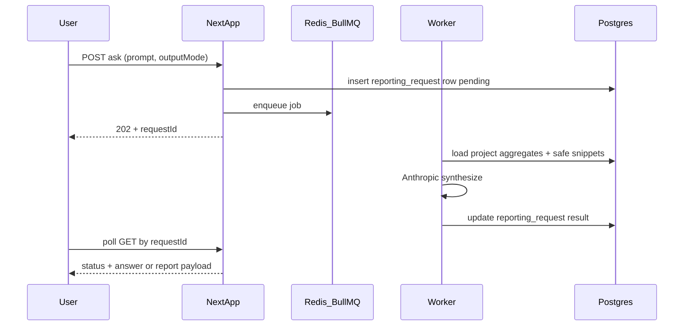

# Reporting dashboard, NL assistant, and Strategy tab

## Context (current app)

- **Tenancy**: Almost all data is **`projectId`-scoped** ([`packages/db/src/schema.ts`](packages/db/src/schema.ts)); there is no separate “organization” entity. Treat **business-level strategy as fields on the current project** (or one row per project in a small table), not cross-project.
- **Nav**: Sidebar links live in [`apps/web/src/app/app/layout.tsx`](apps/web/src/app/app/layout.tsx); add **Reporting** and **Strategy** entries there.
- **Auth**: Reuse [`getCurrentProjectIdForUser`](apps/web/src/lib/current-project.ts) + [`userHasProjectAccess`](apps/web/src/lib/project-access.ts) on every page, action, and route (same pattern as [`apps/web/src/app/api/app/feedbacks/route.ts`](apps/web/src/app/api/app/feedbacks/route.ts)).
- **LLM today**: Anthropic is called from the **worker** via `fetch` in [`apps/worker/src/job-handlers.ts`](apps/worker/src/job-handlers.ts). For mostly-async NL reporting, **keep primary LLM calls in the worker** so timeouts/retries match existing job infrastructure; the web app enqueues work and reads results from the DB.

## 1) Database: project strategy + teams + NL requests

**Strategy (business + teams)**

- **Option A (simplest)**: Add nullable columns on `projects`, e.g. `business_objectives` and `business_strategy` (both `text`), in [`packages/db/src/schema.ts`](packages/db/src/schema.ts). No extra table for “business” level.
- **New table** `teams`: `id`, `project_id`, `name`, `objectives` (`text`), `strategy` (`text`), `created_at`, `updated_at`, index on `project_id`. V1 matches your choice: **no member assignment**.

**NL reporting persistence**

- New table e.g. `reporting_requests`: `id`, `project_id`, `user_id`, `prompt` (`text`), `output_mode` (enum or small int: `answer` vs `report_chart`), `status` (pending / running / done / failed), `error_message` (`text` nullable), `result_markdown` (`text` nullable), `result_structured` (`jsonb` nullable — chart spec + tables for “report/chart” mode), `created_at`, `updated_at`. Indexes on `(project_id, created_at)` for listing history.

**Migrations**

- Extend Drizzle schema, then generate/apply a new migration under [`packages/db/drizzle/`](packages/db/drizzle/) (alongside [`0000_init.sql`](packages/db/drizzle/0000_init.sql)) using your usual `drizzle-kit` workflow; export new tables from [`packages/db/src/client`](packages/db/src) if applicable.

## 2) Strategy tab (UI + server actions)

- New route: **`/app/strategy`** (server component layout consistent with [`apps/web/src/app/app/page.tsx`](apps/web/src/app/app/page.tsx) — Bootstrap cards, forms).
- **Sections**:
  - **Business**: edit project-level objectives/strategy (single form; `userCanEditProject` gate for mutations).
  - **Teams**: list + create/edit/delete team rows for the current project (scoped queries, same edit gate).
- Implement with **Server Actions** in a colocated `actions.ts` (pattern used elsewhere, e.g. [`apps/web/src/app/app/pulse-reports/actions.ts`](apps/web/src/app/app/pulse-reports/actions.ts)): validate input with **zod**, verify membership, then `update(projects)` / `insert|update|delete(teams)`.

## 3) Reporting dashboard (deeper analytics)

- New route: **`/app/reporting`**.
- **Phase 1 content** (all project-scoped Drizzle queries, similar breakdown style to the existing dashboard in [`apps/web/src/app/app/page.tsx`](apps/web/src/app/app/page.tsx)):
  - Time ranges (7d / 30d / 90d) via search params.
  - Volume over time (daily counts), and breakdowns you already have (category, priority, status, source) **filtered by range**.
  - Surface **insights** and **themes** counts or top-N lists from [`insights`](packages/db/src/schema.ts) / [`themes`](packages/db/src/schema.ts) if those tables are populated in your environment.
- **Charts**: There is **no chart library** in [`apps/web/package.json`](apps/web/package.json) today. Add a small dependency (e.g. **Recharts**) *only if* you want real charts in v1; otherwise ship **tables + sparkline-style CSS** or simple bar markup to avoid new deps.

## 4) Natural language: answer vs report/chart (mostly async)

**API**

- Add something like **`POST /api/app/reporting/ask`** (mirror [`apps/web/src/app/api/app/feedbacks/route.ts`](apps/web/src/app/api/app/feedbacks/route.ts)): auth, resolve `projectId`, validate body `{ prompt, outputMode }`, insert `reporting_requests` row, enqueue BullMQ job with `{ requestId }`, return **202** + `{ id, status: "pending" }`.
- Add **`GET /api/app/reporting/requests/[id]`** (or list endpoint) for polling status/result; enforce `userHasProjectAccess` and that the row’s `project_id` matches current project.

**Worker**

- Register a new job name (e.g. `reporting_nl`) in [`apps/worker/src/job-handlers.ts`](apps/worker/src/job-handlers.ts) (and wherever jobs are enqueued/defined — grep for `Queue` / job names in [`apps/worker`](apps/worker)).
- **Data grounding (important for privacy/cost)**: Do **not** paste full feedback history into the model. Build a **fixed, allowlisted “context bundle”** per request, e.g.:
  - Aggregates for the chosen window (counts, breakdowns).
  - Small capped samples: e.g. last N `ai_summary` or truncated `content` with length limits.
  - Top themes/insight titles if present.
- **Prompt behavior**:
  - `answer`: return concise markdown in `result_markdown`.
  - `report_chart`: ask the model for **structured JSON** (validated with zod) describing one or more charts (type, labels, series) plus a short narrative; store in `result_structured` and duplicate a human-readable summary in `result_markdown` if useful.
- **Sync shortcut (optional)**: For very small prompts that map to a known template (e.g. “how many feedback items last 7 days?”), the **route** can answer immediately without a job; keep this narrow to avoid duplicating heavy logic.

**UI**

- On `/app/reporting`, add a client component: textarea for prompt, **radio or select** for “Quick answer” vs “Report / chart”, submit → poll until `done` → render markdown (simple `dangerouslySetInnerHTML` is risky; prefer a tiny markdown renderer or plain `<pre>` for v1) and, for `report_chart`, render charts from `result_structured` using the same chart approach chosen above.
- Show **history** of recent requests for the project (read-only list).

## 5) Env, limits, and quality

- Worker already uses `ANTHROPIC_API_KEY` / `ANTHROPIC_MODEL`; document any new vars only if you split models for reporting.
- Add **rate limiting** per user/project (simple DB count in last hour or in-memory token bucket in worker) to control cost.
- Add **Vitest** tests for zod parsers and any pure “context bundle” builders; optional integration test for the API route with mocked auth.

## 6) Files you will touch (checklist)

| Area | Likely files |
|------|----------------|
| Schema | [`packages/db/src/schema.ts`](packages/db/src/schema.ts), new Drizzle SQL under `packages/db/drizzle/` |
| Nav | [`apps/web/src/app/app/layout.tsx`](apps/web/src/app/app/layout.tsx) |
| Strategy UI | `apps/web/src/app/app/strategy/page.tsx`, `actions.ts` |
| Reporting UI | `apps/web/src/app/app/reporting/page.tsx`, small client component for NL + polling |
| APIs | `apps/web/src/app/api/app/reporting/ask/route.ts`, `.../requests/[id]/route.ts` |
| Worker | [`apps/worker/src/job-handlers.ts`](apps/worker/src/job-handlers.ts), queue registration/enqueue helper |
| Optional charts | [`apps/web/package.json`](apps/web/package.json) |

## Future (out of v1 scope)

- **Team membership** (`team_users` join to `project_users`) when you need ownership or notifications per team.
- **Tool-calling** from the model to run parameterized SQL: only after strict allowlisting and review ([`.claude/skills/security-pii-review/SKILL.md`](.claude/skills/security-pii-review/SKILL.md) applies).
