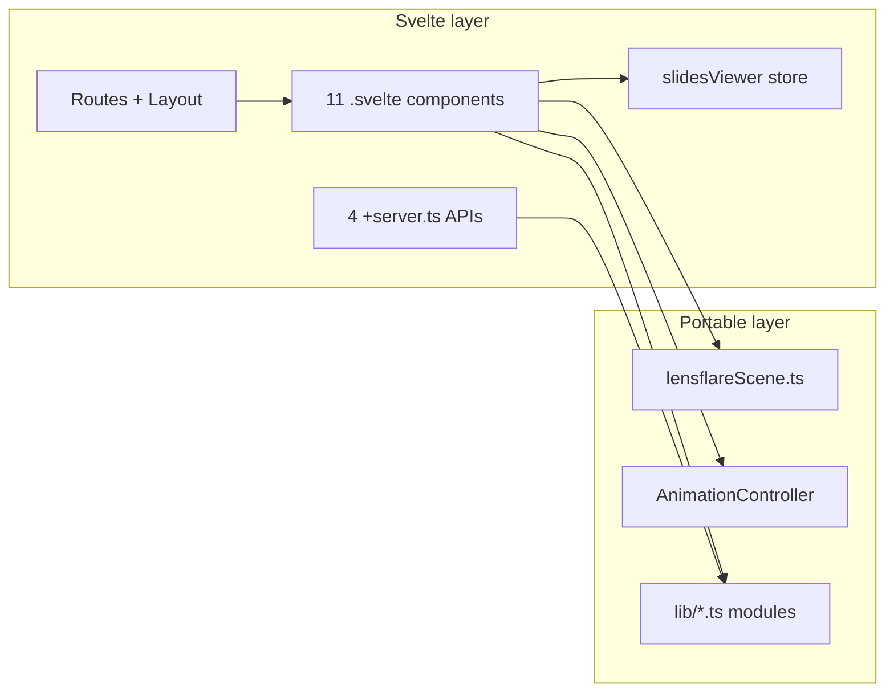

# Svelte to Next.js refactor – effort estimate

## Current architecture (what you have)

- **Framework:** SvelteKit 2, Svelte 5, Vite 6, adapter-vercel.
- **3D:** Main scene is **raw Three.js** in `[src/lib/three/lensflareScene.ts](src/lib/three/lensflareScene.ts)` (WebGPU, TSL, VRM). No Threlte in the critical path; the main page calls `init(container)` / `destroy()` and gets VRM + `AnimationController` back.
- **Svelte surface area:** 11 `.svelte` files (4 route pages, 7 components), 4 API routes, 1 store module, layout with slot.
- **Shared logic:** ~20 `.ts` files in `src/lib` (animation, audio, LLM, mixamo, slides, VRM, etc.) — almost all **framework-agnostic**.

---

## Effort by area

| Area                               | Effort                      | Notes                                                                                                                                                                                                                                                                                                                         |
| ---------------------------------- | --------------------------- | ----------------------------------------------------------------------------------------------------------------------------------------------------------------------------------------------------------------------------------------------------------------------------------------------------------------------------- |
| **API routes (4)**                 | Low (0.5–1 day)             | Replace SvelteKit `RequestHandler` with Next.js Route Handlers (`app/api/.../route.ts`). Swap `$env/dynamic/private` for `process.env`. Request/response bodies stay the same.                                                                                                                                                |
| **Path aliases & env**             | Low (part of setup)         | Replace `$lib` with e.g. `@/lib` in `tsconfig` + `next.config`. Ensure env vars (e.g. `OPENAI_API_KEY`) are exposed per Next.js conventions.                                                                                                                                                                                  |
| **Layout + routing**               | Low (0.5 day)               | Single root layout with `{children}` → `app/layout.tsx` and `app/page.tsx`, `app/slides/page.tsx`, `app/prompt-test/page.tsx`. Move global CSS import into root layout.                                                                                                                                                       |
| **Portable `src/lib`**             | Low (0.5–1 day)             | Keep logic as-is; only change imports from `$lib/...` to `@/lib/...`. Optionally rename `AnimationController.svelte.ts` → `AnimationController.ts`. No Svelte runes or stores in these files.                                                                                                                                 |
| **Svelte → React components (11)** | **Medium–high (1–2 weeks)** | Map runes to hooks: `$state` → `useState`, `$derived` → `useMemo`, `$effect` / `onMount`/`onDestroy` → `useEffect`, `bind:this` → `ref`. Replace `#if`/`#each` with JSX. `[Chat.svelte](src/lib/components/Chat.svelte)` is the largest (509 lines, lots of state/effects) and will take the most care.                       |
| **Stores → React state**           | Medium (1–2 days)           | `[slidesViewer.ts](src/lib/stores/slidesViewer.ts)` (`writable` for `isOnLastSlide`, `audienceViewStream`, `detectionActive`) → React Context or a small store (e.g. Zustand) shared by slides page and `HandDetectionViewer`.                                                                                                |
| **App-specific APIs**              | Low (0.5 day)               | `$app/stores` (`page`) → `useSearchParams()` (or `useParams()`). `$app/environment` (`browser`) → `typeof window !== 'undefined'` or Next’s client checks where needed.                                                                                                                                                       |
| **Threlte**                        | Negligible                  | Only `[BloomPostProcessing.svelte](src/lib/components/BloomPostProcessing.svelte)` and `[RendererConfig.svelte](src/lib/components/RendererConfig.svelte)` use `useThrelte()`; they are **not** used by the main page (which uses `lensflareScene.ts`). You can remove them or reimplement with raw Three.js later if needed. |

---

## What stays the same

- **Three.js scene:** `[lensflareScene.ts](src/lib/three/lensflareScene.ts)` stays as-is; the Next.js page will pass a `ref` to a `div` and call `init(ref.current)` in `useEffect`, mirroring current `onMount`/`onDestroy`.
- **AnimationController:** Plain class; no Svelte. Only import paths and types (used by React components) change.
- **LLM, TTS, speech-to-text, VRM loading, mixamo remap, slides TS modules:** No framework dependency; only `$lib` → `@/lib` (or equivalent) in imports.

---

## Risk / complexity

- **Chat UI:** Dense state and effects (scroll, localStorage, lip-sync config from URL, speaking/listening, errors). Needs a clear React design (e.g. one main state object or several `useState` + `useEffect` for side-effects) to avoid bugs.
- **Slides + HandDetectionViewer:** Shared store state must be replaced with a single shared source (Context or Zustand) so both the slides page and the viewer stay in sync.

---

## Suggested order of work

1. Create Next.js app (App Router), configure `@/lib` and env.
2. Port the 4 API routes to `app/api/.../route.ts`.
3. Implement root layout and the three pages (initially minimal: main page only needs a div + `useEffect` calling `init`/`destroy` and rendering `<Chat />` with the same props you pass today).
4. Convert main page and Chat to React; then StatusIndicator, icons, and other small components.
5. Convert slides page and HandDetectionViewer; replace `slidesViewer` store with Context or Zustand.
6. Port prompt-test page; remove or replace Threlte components if anything still referenced them.
7. Rename/clean up `AnimationController.svelte.ts` and any remaining `$lib` references; run E2E/manual checks.

---

## Bottom line

- **Rough total:** **~2–4 weeks** for one developer, depending on how much you polish and test.
- **Why it’s manageable:** The 3D engine, animation, and most business logic are already in vanilla TS; only the UI layer and routing are Svelte-specific. Moving to Next.js is mostly “rewrite 11 components to React and rewire routing/API/env,” not a full rewrite of the 3D or AI stack.

