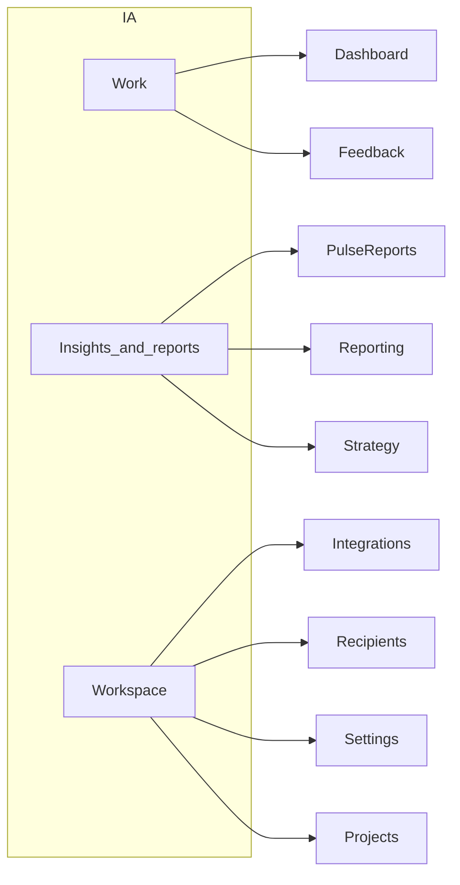

# UX / UI / IA audit — Customer Pulse web app

## Scope and method

**Routes inventoried** (from [`apps/web/src/app/**/page.tsx`](apps/web/src/app)): root redirect, [`/login`](apps/web/src/app/login/page.tsx), and authenticated shell [`/app/*`](apps/web/src/app/app/layout.tsx) — Dashboard, Feedback (+ detail), Integrations (+ new, detail, edit), Recipients (+ new, edit), Settings, Projects (+ new, show, edit, members), Pulse reports (+ detail), Reporting, Strategy, Onboarding.

**Method:** Code and copy review (structure, labels, empty states, developer-facing text, a11y patterns). This does **not** replace a live walkthrough (viewport sizes, keyboard, screen reader, chart behavior). After implementation work, a short usability test on onboarding + feedback triage would pay off.

---

## Information architecture and navigation

- **Sidebar grouping is coherent** ([`apps/web/src/app/app/layout.tsx`](apps/web/src/app/app/layout.tsx)): Work → Insights & reports → Workspace matches mental models; hiding “Setup wizard” after completion is the right call.
- **Project context is easy to miss:** Most pages describe “Project #id” or assume the sidebar switcher is understood. Prefer **project name** (and optional slug) in page subtitles where the DB already loads it (e.g. Dashboard, Feedback header), not only numeric IDs.
- **“Workspace” vs “project”:** Copy mixes “workspace” ([`strategy/page.tsx`](apps/web/src/app/app/strategy/page.tsx)) and “project” elsewhere. Pick one primary term for end users and use it consistently in nav descriptions and headers.
- **Mobile / narrow viewports:** Sidebar is fixed width (`14rem`) with no collapse/hamburger pattern in layout code — likely poor usability on phones. Plan a responsive pattern (drawer, top bar, or collapsible nav).
- **Admin link:** “Job queue (admin)” is appropriately de-emphasized; ensure it never reads as a primary task for normal users.

---

## Critical usability issues (fix first)

1. **Blank page when access is denied for current project**  
   Six pages `return null` when `userHasProjectAccess` is false while a `projectId` exists: [`integrations/page.tsx`](apps/web/src/app/app/integrations/page.tsx), [`recipients/page.tsx`](apps/web/src/app/app/recipients/page.tsx), [`settings/page.tsx`](apps/web/src/app/app/settings/page.tsx), [`reporting/page.tsx`](apps/web/src/app/app/reporting/page.tsx), [`strategy/page.tsx`](apps/web/src/app/app/strategy/page.tsx), [`pulse-reports/page.tsx`](apps/web/src/app/app/pulse-reports/page.tsx). Users see an **empty main column** with no explanation. Replace with a clear message (“You don’t have access to this project”) and actions (switch project, contact admin, go to Projects).

2. **Onboarding step label shows internal keys**  
   [`onboarding/page.tsx`](apps/web/src/app/app/onboarding/page.tsx) shows `step` values like `welcome`, `anthropic_api` in the header. Users should see **human titles** (map from [`onboarding-steps.ts`](apps/web/src/lib/onboarding-steps.ts) or reuse the badge formatting consistently).

3. **Onboarding “Go to dashboard” while incomplete**  
   The footer link to `/app` will **redirect back** into onboarding ([`app/layout.tsx`](apps/web/src/app/app/layout.tsx)), which can feel like a loop. Either remove the link, label it accurately (“You’ll return to setup”), or link to a safe exit (e.g. sign out / help).

---

## Page-by-page notes

| Area | File(s) | UX notes |
|------|---------|----------|
| **Login** | [`login/LoginForm.tsx`](apps/web/src/app/login/LoginForm.tsx) | Dev-oriented copy (`yarn bootstrap:dev-users`) is confusing for real customers; move to docs or dev-only. No “Forgot password” if product supports it. Google button is secondary below card — OK; consider single-column prominence guidelines. |
| **Dashboard** | [`app/page.tsx`](apps/web/src/app/app/page.tsx) | Subtitle exposes email + raw `projectId`. Stat cards are clear; breakdowns show **raw enum values** in lists — same issue as Reporting (below). Recent feedback uses **ISO timestamps**; use relative + absolute on hover or locale date. No deep links from breakdown rows to filtered Feedback. |
| **Feedback list** | [`feedback/page.tsx`](apps/web/src/app/app/feedback/page.tsx) | Strong: filters, bulk actions, pagination. Gaps: no “select all on page”; bulk bar always visible when empty selection — consider disabled state + helper text; **Filter** vs industry expectation “Apply filters” / auto-submit debounce. |
| **Feedback detail** | [`feedback/[id]/page.tsx`](apps/web/src/app/app/feedback/[id]/page.tsx) | Two similar forms (“Edit” vs “Quick override”) need clearer **when to use which** or consolidation. Metadata uses `<dl>` with Bootstrap `row`/`col` on **div** children — verify semantics and screen-reader behavior. “Re-run AI” success assumes infra knowledge. |
| **Integrations** | [`integrations/page.tsx`](apps/web/src/app/app/integrations/page.tsx), [`new/page.tsx`](apps/web/src/app/app/integrations/new/page.tsx) | List is minimal (good); subtitle is **implementation detail** (Lockbox/Rails) — replace with user benefit (“Connections are encrypted”). **New integration** requires **JSON credentials** — very high friction; add per-integration guided fields, links to docs, or templates. “Sync all” needs clearer outcome (“Jobs queued — data appears within ~X min”). |
| **Settings** | [`settings/page.tsx`](apps/web/src/app/app/settings/page.tsx) | “General” section is honest but **discouraging** (read-only + file paths). Either hide until editable, or frame as “Managed by your deployment” with one line. GitHub token field is always empty (password) — add “leave blank to keep existing” if supported, or explain re-entry. |
| **Recipients** | [`recipients/page.tsx`](apps/web/src/app/app/recipients/page.tsx) | Clear list; inactive state is easy to miss — use badge/chip. |
| **Projects** | [`projects/page.tsx`](apps/web/src/app/app/projects/page.tsx), [`[id]/page.tsx`](apps/web/src/app/app/projects/[id]/page.tsx) | Description mentions `project_users` (developer-facing). Show page: counts are good; add **shortcuts** into Feedback / Integrations for this project. “Switch to this project” duplicates sidebar — still useful for discovery. |
| **Reporting** | [`reporting/page.tsx`](apps/web/src/app/app/reporting/page.tsx) | Time range as `7d` / `30d` / `90d` is compact; add **full words** for clarity or tooltips. Chart titles **“(enum id)”** are developer-facing — use the same human labels as [`feedback-enums-display`](apps/web/src/lib/feedback-enums-display.ts). NL assistant ([`ReportingNlAssistant.tsx`](apps/web/src/components/reporting/ReportingNlAssistant.tsx)): long poll with little **progress** UX — add spinner, step text, cancel. |
| **Strategy** | [`strategy/page.tsx`](apps/web/src/app/app/strategy/page.tsx) | Long page with two major forms; consider **anchors** or tabs (Business vs Teams). Team **delete** has no confirmation — risk of accidental loss. Objectives/strategy as single-line inputs for teams may be too small for real content (prefer textarea). |
| **Pulse reports** | [`pulse-reports/page.tsx`](apps/web/src/app/app/pulse-reports/page.tsx), [`[id]/page.tsx`](apps/web/src/app/app/pulse-reports/[id]/page.tsx) | List uses ISO strings; “Report #id” is opaque — prefer date range as title. Pagination shows `Page N` without total (unlike Feedback). “Queue daily pulse” should clarify **who** receives it (link to Recipients). |
| **Onboarding** | [`onboarding/page.tsx`](apps/web/src/app/app/onboarding/page.tsx) | Step copy references **Rails** — remove for end users. Many integration steps in one wizard — consider **skippable sections** with clear “configure later” and links from Integrations. |

---

## Cross-cutting UI and visual design

- **Design system mix:** Bootstrap + React-Bootstrap + Tailwind utilities + custom CSS ([`globals.css`](apps/web/src/app/globals.css)) increases inconsistency risk. [`PageShell`](apps/web/src/components/ui/PageShell.tsx) / [`PageHeader`](apps/web/src/components/ui/PageHeader.tsx) help; extend patterns for **filters**, **empty states**, and **dangerous actions**.
- **Monochrome theme:** Success/warning/info are **neutralized** in CSS variables — good for a calm brand, but **success vs error** may be hard to scan quickly. Consider keeping hue difference for `alert-success` / `alert-danger` only, or stronger icons.
- **Link affordance:** Global link underline on hover is good; sidebar correctly suppresses it. Ensure all interactive cards/rows have visible focus (list-group links are mostly title-only — consider row click or larger hit target).
- **Accessibility:** Prefer one `<h1>` per page (PageHeader does). Form labels are generally present. Charts need **text alternatives** or data tables for screen readers (verify [`ReportingCharts`](apps/web/src/components/reporting/ReportingCharts.tsx)).

---

## Suggested implementation order (after you approve work)

1. Replace `return null` with explicit access-denied UI on all six routes.  
2. Onboarding: human step titles; soften/remove Rails/dev copy; fix dashboard escape link.  
3. Reporting: human-readable chart labels; NL assistant loading state.  
4. Settings/Integrations: user-facing copy; integration creation UX (non-JSON path or heavy helper).  
5. Responsive navigation for small screens.  
6. Date formatting helper used across Dashboard, Feedback, Pulse reports.  
7. Strategy: confirm delete; larger fields for team text.

